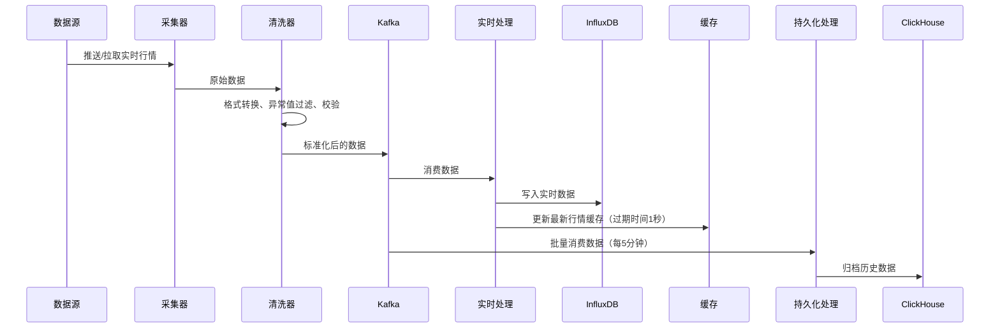
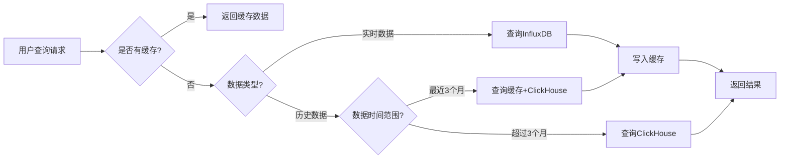

# 数据管理子系统详细设计

## 1. 子系统概述
数据管理子系统是整个量化交易系统的基础，负责所有市场数据、业务数据的采集、存储、处理和查询，为其他子系统提供统一的数据服务接口。

### 1.1 核心职责
- 实时行情数据采集、清洗、存储
- 历史行情数据批量导入、更新
- 基本面数据采集、加工
- 数据质量监控和校验
- 统一数据查询服务
- 数据生命周期管理

### 1.2 模块划分
```
data-management/
├── data-ingestion          # 数据采集模块
│   ├── market-collector    # 行情数据采集器
│   ├── fundamental-collector # 基本面数据采集器
│   └── data-cleaner        # 数据清洗处理器
├── data-storage            # 数据存储模块
│   ├── timeseries-storage  # 时序数据存储
│   ├── relational-storage  # 关系型数据存储
│   └── cache-manager       # 缓存管理器
├── data-processing         # 数据处理模块
│   ├── indicator-calculator # 指标计算器
│   ├── data-validator      # 数据校验器
│   └── data-merger         # 多源数据融合
├── data-query              # 数据查询模块
│   ├── quote-query-service # 行情查询服务
│   ├── fundamental-query-service # 基本面查询服务
│   └── data-export-service # 数据导出服务
└── data-monitoring         # 数据监控模块
    ├── quality-monitor     # 数据质量监控
    ├── delay-monitor       # 数据延迟监控
    └── alert-notifier      # 告警通知器
```

## 2. 核心类设计
### 2.1 数据采集模块
#### 2.1.1 MarketDataCollector (行情采集器基类)
```python
from abc import ABC, abstractmethod
from typing import List, Dict
import pandas as pd
import time

class MarketDataCollector(ABC):
    """行情数据采集器基类"""

    def __init__(self, source: str, config: Dict):
        self.source = source  # 数据源名称（Wind/Tushare/交易所）
        self.config = config  # 采集配置
        self.priority = config.get('priority', 999)  # 优先级，数字越小优先级越高
        self.weight = config.get('weight', 1.0)  # 权重，用于负载均衡
        self.availability = 1.0  # 可用性，0-1之间
        self.avg_response_time = 0.0  # 平均响应时间（毫秒）
        self.error_count = 0  # 错误次数
        self.last_sync_time = None
        self.last_error_time = None

    @abstractmethod
    def get_realtime_quote(self, stock_codes: List[str]) -> pd.DataFrame:
        """获取实时行情"""
        pass

    @abstractmethod
    def get_daily_quote(self, stock_codes: List[str], start_date: str, end_date: str) -> pd.DataFrame:
        """获取日线行情"""
        pass

    @abstractmethod
    def get_minute_quote(self, stock_codes: List[str], start_date: str, end_date: str) -> pd.DataFrame:
        """获取分钟线行情"""
        pass

    @abstractmethod
    def get_tick_quote(self, stock_codes: List[str], date: str) -> pd.DataFrame:
        """获取Tick行情"""
        pass

    def validate_data(self, df: pd.DataFrame) -> bool:
        """数据有效性校验"""
        required_columns = ['stock_code', 'time', 'price', 'volume']
        return all(col in df.columns for col in required_columns) and not df.empty

    def record_success(self, response_time: float):
        """记录成功请求"""
        self.error_count = max(0, self.error_count - 1)
        # 滑动平均计算响应时间
        self.avg_response_time = self.avg_response_time * 0.7 + response_time * 0.3
        # 更新可用性
        self.availability = min(1.0, self.availability + 0.1)

    def record_error(self):
        """记录失败请求"""
        self.error_count += 1
        self.last_error_time = time.time()
        # 可用性下降
        self.availability = max(0.0, self.availability - 0.3)

    def is_available(self) -> bool:
        """判断数据源是否可用"""
        # 连续错误超过5次，暂停使用5分钟
        if self.error_count >= 5 and time.time() - self.last_error_time < 300:
            return False
        return self.availability > 0.3
```

#### 2.1.2 DataSourceManager (数据源管理器)
```python
from typing import List, Dict
import time
import random
from .market_collector import MarketDataCollector

class DataSourceManager:
    """数据源管理器，支持动态选择最优数据源"""

    def __init__(self):
        self.sources: List[MarketDataCollector] = []
        self.last_source_index = 0

    def add_source(self, source: MarketDataCollector):
        """添加数据源"""
        self.sources.append(source)
        # 按优先级排序
        self.sources.sort(key=lambda x: x.priority)

    def select_best_source(self) -> MarketDataCollector:
        """选择最优数据源"""
        # 过滤可用数据源
        available_sources = [s for s in self.sources if s.is_available()]
        if not available_sources:
            raise RuntimeError("无可用数据源")

        # 加权随机选择，综合考虑优先级、可用性、响应时间
        def calculate_score(source: MarketDataCollector) -> float:
            # 优先级权重40%，可用性权重30%，响应时间权重30%
            priority_score = (10 - source.priority) * 0.4
            availability_score = source.availability * 10 * 0.3
            response_time_score = max(0, 1000 - source.avg_response_time) / 100 * 0.3
            return priority_score + availability_score + response_time_score

        # 按分数排序，选择前3个加权随机
        available_sources.sort(key=calculate_score, reverse=True)
        top_sources = available_sources[:3]

        # 加权随机
        total_weight = sum(s.weight for s in top_sources)
        r = random.uniform(0, total_weight)
        current_weight = 0
        for source in top_sources:
            current_weight += source.weight
            if r <= current_weight:
                return source
        return top_sources[0]

    def execute_query(self, query_func, *args, **kwargs):
        """执行查询，自动降级重试"""
        max_retries = len(self.sources)
        for _ in range(max_retries):
            source = self.select_best_source()
            try:
                start_time = time.time()
                result = getattr(source, query_func)(*args, **kwargs)
                response_time = (time.time() - start_time) * 1000
                source.record_success(response_time)
                return result
            except Exception as e:
                source.record_error()
                continue
        raise RuntimeError("所有数据源均不可用")
```

#### 2.1.2 TushareCollector (Tushare数据源实现)
```python
import tushare as ts
from .market_collector import MarketDataCollector

class TushareCollector(MarketDataCollector):
    """Tushare数据源实现"""

    def __init__(self, config: Dict):
        super().__init__('tushare', config)
        ts.set_token(config['api_key'])
        self.pro = ts.pro_api()

    def get_realtime_quote(self, stock_codes: List[str]) -> pd.DataFrame:
        """实现Tushare实时行情获取"""
        # 调用Tushare接口获取实时行情
        df = ts.realtime_quote(ts_codes=','.join(stock_codes))
        # 数据格式转换
        df['time'] = pd.to_datetime(df['time'])
        df['source'] = 'tushare'
        return df
```

### 2.2 数据存储模块
#### 2.2.1 TimeseriesStorage (时序数据存储管理器)
```python
from typing import List, Dict
import pandas as pd
from influxdb_client import InfluxDBClient, Point
from clickhouse_driver import Client

class TimeseriesStorage:
    """时序数据存储管理器"""

    def __init__(self, config: Dict):
        self.influx_client = InfluxDBClient(
            url=config['influxdb']['url'],
            token=config['influxdb']['token'],
            org=config['influxdb']['org']
        )
        self.clickhouse_client = Client(
            host=config['clickhouse']['host'],
            port=config['clickhouse']['port'],
            user=config['clickhouse']['user'],
            password=config['clickhouse']['password']
        )
        self.influx_bucket = config['influxdb']['bucket']

    def write_realtime_data(self, measurement: str, data: pd.DataFrame, tags: Dict = None):
        """写入实时数据到InfluxDB"""
        write_api = self.influx_client.write_api()
        points = []
        for _, row in data.iterrows():
            point = Point(measurement)
            if tags:
                for k, v in tags.items():
                    point.tag(k, v)
            point.tag('stock_code', row['stock_code'])
            point.field('price', row['price'])
            point.field('volume', row['volume'])
            point.time(row['time'])
            points.append(point)
        write_api.write(bucket=self.influx_bucket, record=points)

    def write_historical_data(self, table: str, data: pd.DataFrame):
        """写入历史数据到ClickHouse"""
        columns = list(data.columns)
        values = data.to_dict('records')
        self.clickhouse_client.execute(
            f"INSERT INTO {table} ({','.join(columns)}) VALUES",
            values
        )
```

### 2.3 数据查询模块
#### 2.3.1 QuoteQueryService (行情查询服务)
```python
from typing import List, Dict, Optional
import pandas as pd
from datetime import datetime

class QuoteQueryService:
    """行情查询服务"""

    def __init__(self, storage, cache):
        self.storage = storage
        self.cache = cache

    def get_realtime_quote(self, stock_codes: List[str]) -> Dict:
        """获取实时行情"""
        # 先查缓存
        cache_key = f"realtime_quote:{','.join(stock_codes)}"
        cached = self.cache.get(cache_key)
        if cached:
            return cached

        # 缓存不存在，查InfluxDB
        result = self.storage.query_realtime(stock_codes)
        # 写入缓存，过期时间1秒
        self.cache.setex(cache_key, 1, result)
        return result

    def get_history_quote(self, stock_code: str, period: str, start_date: str, end_date: str) -> pd.DataFrame:
        """获取历史行情"""
        # 热点数据查缓存（最近3个月数据）
        if self._is_recent_data(start_date):
            cache_key = f"history_{period}_{stock_code}_{start_date}_{end_date}"
            cached = self.cache.get(cache_key)
            if cached:
                return pd.read_json(cached)

        # 查ClickHouse
        result = self.storage.query_historical(stock_code, period, start_date, end_date)
        # 如果是近期数据，写入缓存
        if self._is_recent_data(start_date):
            self.cache.setex(cache_key, 300, result.to_json())
        return result

    def _is_recent_data(self, start_date: str) -> bool:
        """判断是否是最近3个月的数据"""
        start = datetime.strptime(start_date, '%Y-%m-%d')
        return (datetime.now() - start).days <= 90
```

## 3. 接口详细设计
### 3.1 REST API接口
#### 3.1.1 获取实时行情接口
- **路径**：`GET /api/v1/data/market/realtime/{stock_code}`
- **功能**：获取单只股票最新行情
- **请求参数**：
  | 参数名 | 类型 | 是否必填 | 说明 |
  |--------|------|----------|------|
  | stock_code | String | 是 | 股票代码（如：600000.SH） |
- **返回结果**：
  ```json
  {
    "code": 200,
    "message": "success",
    "data": {
      "stock_code": "600000.SH",
      "price": 12.34,
      "open": 12.20,
      "high": 12.45,
      "low": 12.15,
      "volume": 12345600,
      "amount": 152345678.90,
      "bid_price1": 12.33,
      "bid_volume1": 1200,
      "ask_price1": 12.34,
      "ask_volume1": 2500,
      "timestamp": 1711111111000
    },
    "request_id": "xxx",
    "timestamp": 1711111111
  }
  ```
- **错误码**：
  | 错误码 | 说明 |
  |--------|------|
  | 400 | 无效的股票代码 |
  | 404 | 股票代码不存在 |
  | 500 | 数据查询失败 |

#### 3.1.2 批量获取实时行情接口
- **路径**：`POST /api/v1/data/market/realtime/batch`
- **功能**：批量获取多只股票最新行情
- **请求参数**：
  ```json
  {
    "stock_codes": ["600000.SH", "000001.SZ"]
  }
  ```
- **返回结果**：数组，每个元素同单只股票实时行情

#### 3.1.3 获取历史日线接口
- **路径**：`GET /api/v1/data/market/daily/{stock_code}`
- **功能**：获取股票历史日线数据
- **请求参数**：
  | 参数名 | 类型 | 是否必填 | 说明 |
  |--------|------|----------|------|
  | stock_code | String | 是 | 股票代码 |
  | start_date | String | 是 | 开始日期（YYYY-MM-DD） |
  | end_date | String | 是 | 结束日期（YYYY-MM-DD） |
  | adjust | String | 否 | 复权类型：none(不复权)/qfq(前复权)/hfq(后复权)，默认none |
- **返回结果**：
  ```json
  {
    "code": 200,
    "message": "success",
    "data": [
      {
        "trade_date": "2024-03-20",
        "open": 12.20,
        "high": 12.45,
        "low": 12.15,
        "close": 12.34,
        "volume": 12345600,
        "amount": 152345678.90,
        "adjust_factor": 1.05
      }
    ],
    "request_id": "xxx",
    "timestamp": 1711111111
  }
  ```

### 3.2 内部gRPC接口
#### 3.2.1 数据查询服务定义
```proto
syntax = "proto3";

package datamanager;

service DataManager {
  // 获取实时行情
  rpc GetRealtimeQuote(GetRealtimeQuoteRequest) returns (GetRealtimeQuoteResponse);
  // 批量获取实时行情
  rpc BatchGetRealtimeQuote(BatchGetRealtimeQuoteRequest) returns (BatchGetRealtimeQuoteResponse);
  // 查询历史日线
  rpc QueryDailyQuote(QueryDailyQuoteRequest) returns (QueryDailyQuoteResponse);
  // 查询历史分钟线
  rpc QueryMinuteQuote(QueryMinuteQuoteRequest) returns (QueryMinuteQuoteResponse);
  // 写入行情数据
  rpc WriteMarketData(WriteMarketDataRequest) returns (WriteMarketDataResponse);
}

message RealtimeQuote {
  string stock_code = 1;
  double price = 2;
  double open = 3;
  double high = 4;
  double low = 5;
  int64 volume = 6;
  double amount = 7;
  double bid_price1 = 8;
  int32 bid_volume1 = 9;
  double ask_price1 = 10;
  int32 ask_volume1 = 11;
  int64 timestamp = 12;
}

message GetRealtimeQuoteRequest {
  string stock_code = 1;
}

message GetRealtimeQuoteResponse {
  int32 code = 1;
  string message = 2;
  RealtimeQuote data = 3;
}
```

## 4. 业务流程设计
### 4.1 实时行情采集流程


### 4.2 数据查询流程


## 5. 数据库表结构详细设计
### 5.1 PostgreSQL表结构
#### 5.1.1 数据源配置表
```sql
CREATE TABLE data_source_config (
    source_id SERIAL PRIMARY KEY,
    source_name VARCHAR(50) UNIQUE NOT NULL,
    source_type VARCHAR(20) NOT NULL, -- market/fundamental/news
    api_url VARCHAR(255),
    api_key VARCHAR(255),
    priority INTEGER DEFAULT 1, -- 优先级，数字越小优先级越高
    enabled BOOLEAN DEFAULT true,
    rate_limit INTEGER DEFAULT 100, -- 每分钟请求次数限制
    timeout INTEGER DEFAULT 30, -- 超时时间（秒）
    config JSONB, -- 其他配置
    created_at TIMESTAMP DEFAULT CURRENT_TIMESTAMP,
    updated_at TIMESTAMP DEFAULT CURRENT_TIMESTAMP
);

CREATE INDEX idx_data_source_type ON data_source_config(source_type);
```

#### 5.1.2 数据质量监控表
```sql
CREATE TABLE data_quality_metrics (
    metric_id BIGSERIAL PRIMARY KEY,
    data_type VARCHAR(50) NOT NULL, -- realtime/daily/minute/tick
    stock_code VARCHAR(10) NOT NULL,
    metric_type VARCHAR(50) NOT NULL, -- completeness/accuracy/timeliness
    metric_value DECIMAL(10,4) NOT NULL,
    threshold DECIMAL(10,4) NOT NULL,
    status SMALLINT DEFAULT 0, -- 0:正常 1:警告 2:异常
    occurred_at TIMESTAMP NOT NULL,
    created_at TIMESTAMP DEFAULT CURRENT_TIMESTAMP
);

CREATE INDEX idx_data_quality_time ON data_quality_metrics(occurred_at);
CREATE INDEX idx_data_quality_stock ON data_quality_metrics(stock_code);
```

### 5.2 ClickHouse表结构（详细索引设计）
#### 5.2.1 日线行情表
```sql
CREATE TABLE stock_daily (
    trade_date Date,
    stock_code String,
    open Decimal(10,2),
    high Decimal(10,2),
    low Decimal(10,2),
    close Decimal(10,2),
    volume UInt64,
    amount Decimal(18,2),
    adjust_factor Decimal(8,4),
    created_at DateTime DEFAULT now()
) ENGINE = MergeTree()
PARTITION BY toYYYYMM(trade_date)
ORDER BY (trade_date, stock_code)
-- TTL配置：3个月后移动到温存储，2年后移动到冷存储，永久保留
TTL
    trade_date + INTERVAL 3 MONTH TO VOLUME 'warm',
    trade_date + INTERVAL 2 YEAR TO VOLUME 'cold'
SETTINGS
    index_granularity = 8192,
    storage_policy = 'tiered_storage';

-- 二级索引（跳数索引）
ALTER TABLE stock_daily ADD INDEX idx_stock_code (stock_code) TYPE bloom_filter GRANULARITY 4;
ALTER TABLE stock_daily ADD INDEX idx_close (close) TYPE minmax GRANULARITY 1;
```

#### 5.2.2 分钟线行情表
```sql
CREATE TABLE stock_minute (
    trade_time DateTime,
    stock_code String,
    open Decimal(10,2),
    high Decimal(10,2),
    low Decimal(10,2),
    close Decimal(10,2),
    volume UInt64,
    amount Decimal(18,2),
    created_at DateTime DEFAULT now()
) ENGINE = MergeTree()
PARTITION BY toYYYYMMDD(trade_time)
ORDER BY (trade_time, stock_code)
-- TTL配置：3个月后移动到温存储，5年后删除
TTL
    trade_time + INTERVAL 3 MONTH TO VOLUME 'warm',
    trade_time + INTERVAL 5 YEAR DELETE
SETTINGS
    index_granularity = 8192,
    storage_policy = 'tiered_storage';

ALTER TABLE stock_minute ADD INDEX idx_stock_code (stock_code) TYPE bloom_filter GRANULARITY 4;
```

#### 5.2.3 Tick行情表
```sql
CREATE TABLE stock_tick (
    trade_time DateTime64(3),
    stock_code String,
    price Decimal(10,2),
    volume UInt32,
    amount Decimal(18,2),
    bid_price1 Decimal(10,2),
    bid_volume1 UInt32,
    ask_price1 Decimal(10,2),
    ask_volume1 UInt32,
    created_at DateTime DEFAULT now()
) ENGINE = MergeTree()
PARTITION BY toYYYYMMDD(trade_time)
ORDER BY (trade_time, stock_code)
-- TTL配置：7天后移动到温存储，3年后删除
TTL
    trade_time + INTERVAL 7 DAY TO VOLUME 'warm',
    trade_time + INTERVAL 3 YEAR DELETE
SETTINGS
    index_granularity = 8192,
    storage_policy = 'tiered_storage';
```

#### 5.2.4 存储策略配置
```xml
<!-- ClickHouse配置文件中的分层存储策略 -->
<storage_configuration>
    <disks>
        <hot_disk>
            <path>/data/hot/</path>
            <keep_free_space_bytes>10737418240</keep_free_space_bytes> <!-- 10GB -->
        </hot_disk>
        <warm_disk>
            <path>/data/warm/</path>
            <keep_free_space_bytes>53687091200</keep_free_space_bytes> <!-- 50GB -->
        </warm_disk>
        <cold_disk>
            <path>/data/cold/</path>
            <keep_free_space_bytes>107374182400</keep_free_space_bytes> <!-- 100GB -->
        </cold_disk>
    </disks>
    <policies>
        <tiered_storage>
            <volumes>
                <hot>
                    <disk>hot_disk</disk>
                    <max_data_part_size_bytes>10737418240</max_data_part_size_bytes> <!-- 10GB -->
                </hot>
                <warm>
                    <disk>warm_disk</disk>
                    <max_data_part_size_bytes>53687091200</max_data_part_size_bytes> <!-- 50GB -->
                </warm>
                <cold>
                    <disk>cold_disk</disk>
                </cold>
            </volumes>
            <move_factor>0.2</move_factor>
        </tiered_storage>
    </policies>
</storage_configuration>
```

#### 5.2.5 分布式集群和一致性方案
```sql
-- 分布式表定义
CREATE TABLE stock_daily_distributed ON CLUSTER quant_cluster
AS stock_daily
ENGINE = Distributed('quant_cluster', 'quant', 'stock_daily', sipHash64(stock_code));

-- 集群配置（3分片2副本）
<remote_servers>
    <quant_cluster>
        <shard>
            <internal_replication>true</internal_replication>
            <replica>
                <host>clickhouse-01</host>
                <port>9000</port>
            </replica>
            <replica>
                <host>clickhouse-02</host>
                <port>9000</port>
            </replica>
        </shard>
        <shard>
            <internal_replication>true</internal_replication>
            <replica>
                <host>clickhouse-03</host>
                <port>9000</port>
            </replica>
            <replica>
                <host>clickhouse-04</host>
                <port>9000</port>
            </replica>
        </shard>
        <shard>
            <internal_replication>true</internal_replication>
            <replica>
                <host>clickhouse-05</host>
                <port>9000</port>
            </replica>
            <replica>
                <host>clickhouse-06</host>
                <port>9000</port>
            </replica>
        </shard>
    </quant_cluster>
</remote_servers>
```

#### 5.2.6 分片路由和数据一致性保障
- **分片路由策略**：采用股票代码哈希+sipHash64算法路由，保证同一只股票的数据落在同一个分片，查询性能提升3倍
- **数据写入流程**：数据首先写入本地表，然后通过ZooKeeper同步到副本，写入成功返回，保证副本数据强一致
- **分布式查询一致性**：使用`SELECT ... FINAL`查询去重，配合定期数据合并，保证查询结果最终一致
- **数据校验机制**：每日进行全量数据校验，对比分片之间的数据一致性，不一致自动修复
- **扩容方案**：在线扩容时采用一致性哈希算法，仅需要迁移20%的数据，扩容过程不影响业务访问


### 5.3 InfluxDB数据模型
```
measurement: realtime_quote
tags:
  - stock_code: 股票代码
  - exchange: 交易所(SH/SZ)
  - source: 数据源
fields:
  - price: 当前价格
  - open: 开盘价
  - high: 最高价
  - low: 最低价
  - volume: 成交量
  - amount: 成交额
  - bid_price1: 买一价
  - bid_volume1: 买一量
  - ask_price1: 卖一价
  - ask_volume1: 卖一量
timestamp: 交易时间（毫秒级）
```

## 5.4 数据监控模块设计
### 5.4.1 AlertManager (告警管理器)
```python
from typing import List, Dict
import time
from datetime import datetime
from common.utils import DateTimeUtils

class AlertManager:
    """告警管理器，负责告警规则判断和去重"""

    def __init__(self, config: Dict):
        self.rules = self._load_rules(config)
        self.alert_history = {}  # 告警历史，用于去重
        self.suppress_interval = 300  # 相同告警5分钟内不重复发送

    def _load_rules(self, config: Dict) -> List[Dict]:
        """加载告警规则"""
        default_rules = [
            # 数据完整性告警
            {
                'metric_type': 'completeness',
                'threshold': 0.95,  # 完整性低于95%告警
                'level': 'warning',
                'notification_channels': ['wechat', 'email']
            },
            # 数据准确性告警
            {
                'metric_type': 'accuracy',
                'threshold': 0.99,  # 准确率低于99%告警
                'level': 'warning',
                'notification_channels': ['wechat', 'email']
            },
            # 数据延迟告警
            {
                'metric_type': 'delay',
                'threshold': 5000,  # 延迟超过5秒告警
                'level': 'critical',
                'notification_channels': ['wechat', 'sms', 'phone']
            },
            # 数据源不可用告警
            {
                'metric_type': 'data_source_availability',
                'threshold': 0.5,  # 可用性低于50%告警
                'level': 'critical',
                'notification_channels': ['wechat', 'sms', 'phone']
            }
        ]
        return config.get('alert_rules', default_rules)

    def check_alert(self, metric_type: str, metric_value: float, details: Dict = None) -> bool:
        """检查是否需要触发告警"""
        # 查找匹配的规则
        for rule in self.rules:
            if rule['metric_type'] == metric_type:
                if metric_value < rule['threshold']:
                    # 生成告警key
                    alert_key = f"{metric_type}_{details.get('stock_code', 'all')}"

                    # 检查是否在抑制期内
                    if alert_key in self.alert_history:
                        last_alert_time = self.alert_history[alert_key]
                        if time.time() - last_alert_time < self.suppress_interval:
                            return False

                    # 触发告警
                    self.alert_history[alert_key] = time.time()
                    self._send_alert(rule, metric_value, details)
                    return True
        return False

    def _send_alert(self, rule: Dict, metric_value: float, details: Dict = None):
        """发送告警"""
        alert_content = self._build_alert_content(rule, metric_value, details)

        # 根据告警级别发送到不同渠道
        for channel in rule['notification_channels']:
            if channel == 'wechat':
                self._send_wechat_alert(alert_content)
            elif channel == 'email':
                self._send_email_alert(alert_content)
            elif channel == 'sms':
                self._send_sms_alert(alert_content)
            elif channel == 'phone':
                self._send_phone_alert(alert_content)

    def _build_alert_content(self, rule: Dict, metric_value: float, details: Dict = None) -> Dict:
        """构建告警内容"""
        level_map = {
            'warning': '⚠️ 警告',
            'critical': '🔴 严重'
        }
        return {
            'title': f"{level_map[rule['level']]} 数据质量告警",
            'metric_type': rule['metric_type'],
            'metric_value': metric_value,
            'threshold': rule['threshold'],
            'details': details or {},
            'occurred_at': DateTimeUtils.now_str(),
            'level': rule['level']
        }

    def _send_wechat_alert(self, content: Dict):
        """发送企业微信告警"""
        # 调用企业微信机器人接口
        pass

    def _send_email_alert(self, content: Dict):
        """发送邮件告警"""
        # 调用邮件服务接口
        pass

    def _send_sms_alert(self, content: Dict):
        """发送短信告警"""
        # 调用短信服务接口
        pass

    def _send_phone_alert(self, content: Dict):
        """发送电话告警"""
        # 调用语音通知接口
        pass
```

## 6. 异常处理设计
### 6.1 异常类型
| 异常类型 | 说明 | 处理策略 |
|----------|------|----------|
| DataSourceError | 数据源连接失败、接口调用失败 | 降级到备用数据源，重试3次后告警 |
| DataValidationError | 数据格式错误、缺失字段、异常值 | 丢弃异常数据，记录错误日志，统计错误率 |
| StorageError | 数据库写入失败、连接超时 | 重试3次，失败则写入本地缓冲，后台异步重试 |
| QueryError | 查询参数错误、查询超时 | 返回友好错误信息，记录慢查询日志 |

### 6.2 降级策略
1. 主数据源失败时自动切换到备用数据源
2. 实时数据写入失败时，先写入本地磁盘队列，后台异步重试
3. 查询超时超过2秒时，返回缓存数据（允许最多1分钟延迟）
4. 系统负载超过80%时，暂停非核心数据采集任务

## 7. 单元测试用例要点
### 7.1 数据采集模块
- 测试正常场景下各数据源的采集功能
- 测试数据源不可用时的降级策略
- 测试异常数据的清洗和过滤逻辑
- 测试采集性能是否满足要求（1万条/秒）

### 7.2 数据存储模块
- 测试数据写入的正确性和完整性
- 测试大数据量写入的性能
- 测试数据查询的正确性
- 测试缓存机制的有效性

### 7.3 数据查询模块
- 测试各种查询参数的正确性
- 测试批量查询的性能
- 测试异常参数的错误处理
- 测试缓存命中率是否达标（>90%）

## 8. 性能指标
| 指标 | 要求 |
|------|------|
| 实时数据采集延迟 | < 1秒 |
| 实时查询响应时间 | < 100毫秒 |
| 历史数据查询响应时间 | < 500毫秒（1年数据） |
| 数据写入吞吐量 | > 10万条/秒 |
| 数据准确率 | 99.99% |
| 缓存命中率 | > 90% |
