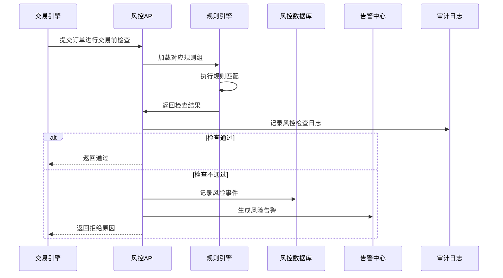
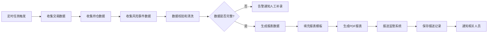

# 风险管理子系统详细设计

## 1. 子系统概述
风险管理子系统是量化交易系统的核心安全模块，负责全系统的风险监控、合规检查、风险预警和风险控制，保障交易系统的安全性和合规性，符合金融监管要求。

### 1.1 核心职责
- 实时交易风险监控和预警
- 动态合规规则引擎和检查
- 市场风险、信用风险、操作风险识别
- 压力测试和风险情景分析
- 风险限额管理和控制
- 合规审计和报表自动生成
- 反洗钱和异常交易识别

### 1.2 设计目标
- **实时性**：风控检查平均延迟<1ms，99分位<5ms
- **准确性**：风险识别准确率100%，零漏报
- **灵活性**：规则可动态配置，无需重启系统
- **合规性**：完全符合A股市场监管要求
- **可追溯性**：所有风控操作留痕，支持审计追溯

### 1.3 模块划分
```
risk-management/
├── rule-engine           # 规则引擎模块
│   ├── drools-executor   # Drools规则执行器
│   ├── rule-manager      # 规则管理器
│   └── rule-deployer     # 规则发布器
├── realtime-monitor      # 实时监控模块
│   ├── trade-monitor     # 交易行为监控
│   ├── position-monitor  # 持仓风险监控
│   ├── market-monitor    # 市场风险监控
│   └── alert-generator   # 告警生成器
├── compliance-management # 合规管理模块
│   ├── compliance-checker # 合规检查器
│   ├── abnormal-trade-detector # 异常交易检测
│   ├── anti-money-laundering # 反洗钱检查
│   └── report-generator  # 合规报表生成
├── risk-calculation      # 风险计算模块
│   ├── var-calculator    # VaR风险价值计算
│   ├── stress-tester     # 压力测试器
│   ├── scenario-analyzer # 情景分析器
│   └── limit-manager     # 风险限额管理器
└── audit-trail           # 审计跟踪模块
    ├── operation-logger  # 操作日志记录
    ├── risk-event-store  # 风险事件存储
    └── evidence-manager  # 证据链管理
```

## 2. 核心类设计
### 2.1 规则引擎模块
#### 2.1.1 RuleEngine (规则引擎核心)
```java
// 采用Drools规则引擎实现
package com.quant.risk.engine;

import org.kie.api.KieServices;
import org.kie.api.runtime.KieContainer;
import org.kie.api.runtime.KieSession;
import java.util.List;
import java.util.Map;

public class RuleEngine {
    private static final KieServices kieServices = KieServices.Factory.get();
    private final KieContainer kieContainer;
    private final Map<String, KieSession> sessionCache;

    public RuleEngine() {
        this.kieContainer = kieServices.getKieClasspathContainer();
        this.sessionCache = new ConcurrentHashMap<>();
    }

    /**
     * 执行风控规则检查
     * @param fact 事实对象（订单、仓位、用户等）
     * @param ruleGroup 规则组（pre-trade/intraday/compliance等）
     * @return 规则执行结果
     */
    public RuleResult execute(Object fact, String ruleGroup) {
        KieSession kieSession = getKieSession(ruleGroup);
        RuleResult result = new RuleResult();
        kieSession.setGlobal("result", result);
        kieSession.insert(fact);
        int firedRules = kieSession.fireAllRules();
        kieSession.dispose();
        result.setFiredRules(firedRules);
        return result;
    }

    /**
     * 动态加载新规则
     * @param ruleContent 规则文件内容（DRL格式）
     * @param ruleGroup 规则组
     * @return 是否加载成功
     */
    public boolean loadRule(String ruleContent, String ruleGroup) {
        // 动态编译和加载规则
        KieModule kieModule = createKieModule(ruleContent);
        kieContainer.updateKieModule(kieModule.getReleaseId(), kieModule);
        sessionCache.remove(ruleGroup);
        return true;
    }

    /**
     * 灰度发布规则，仅对指定比例的用户生效
     * @param ruleContent 规则内容
     * @param ruleGroup 规则组
     * @param grayPercentage 灰度比例（0-100）
     * @param grayUsers 指定灰度用户列表
     * @return 是否发布成功
     */
    public boolean loadRuleGray(String ruleContent, String ruleGroup, int grayPercentage, List<Long> grayUsers) {
        // 保存灰度规则版本
        RuleVersion grayVersion = saveGrayRuleVersion(ruleContent, ruleGroup, grayPercentage, grayUsers);
        // 加载到规则引擎，添加灰度条件
        String grayRuleContent = addGrayCondition(ruleContent, grayVersion.getId(), grayPercentage, grayUsers);
        return loadRule(grayRuleContent, ruleGroup);
    }

    /**
     * 规则回滚到上一版本
     * @param ruleGroup 规则组
     * @param versionId 目标版本ID
     * @return 是否回滚成功
     */
    public boolean rollbackRule(String ruleGroup, String versionId) {
        RuleVersion version = getRuleVersion(versionId);
        if (version == null) {
            return false;
        }
        // 加载历史版本
        return loadRule(version.getContent(), ruleGroup);
    }

    private String addGrayCondition(String ruleContent, String versionId, int grayPercentage, List<Long> grayUsers) {
        // 给规则添加灰度条件，只有符合条件的请求才会执行新规则
        String grayCondition = String.format(
            "eval( (user_id == null || %s.contains(user_id) || Math.abs(user_id.hashCode() %% 100) < %d) )",
            grayUsers, grayPercentage
        );
        // 插入到规则条件中
        return insertConditionToRule(ruleContent, grayCondition);
    }

    private KieSession getKieSession(String ruleGroup) {
        return sessionCache.computeIfAbsent(ruleGroup,
            k -> kieContainer.newKieSession(ruleGroup + "-session"));
    }
}

// 规则执行结果
public class RuleResult {
    private boolean passed = true;
    private List<RuleViolation> violations = new ArrayList<>();
    private int firedRules;
    //  getter/setter
}

// 规则违反项
public class RuleViolation {
    private String ruleId;
    private String ruleName;
    private String level; // warning/error/block
    private String message;
    private Map<String, Object> details;
    //  getter/setter
}
```

#### 2.1.2 内置规则模板（DRL示例）
```drools
package com.quant.risk.rules.pre_trade

import com.quant.trade.model.Order
import com.quant.risk.model.RuleResult

rule "单日累计交易额超过限额"
    ruleflow-group "pre-trade"
    when
        $order: Order(side == OrderSide.BUY)
        $dailyAmount: Number(doubleValue > 1000000) from accumulate(
            Order(userId == $order.getUserId(),
                  status == OrderStatus.FILLED,
                  createdAt > LocalDate.now().atStartOfDay()),
            sum($order.getAmount())
        )
        $result: RuleResult()
    then
        $result.setPassed(false);
        $result.addViolation(
            "RULE-001",
            "单日累计交易额超过限额",
            "block",
            "用户单日累计买入金额已超过100万限额",
            Map.of("currentAmount", $dailyAmount, "limit", 1000000)
        );
end

rule "单只股票持仓比例超限"
    ruleflow-group "pre-trade"
    when
        $order: Order()
        $position: Position(userId == $order.getUserId(),
                           stockCode == $order.getStockCode(),
                           quantity * $order.getPrice() / $account.getTotalAsset() > 0.3)
        $result: RuleResult()
    then
        $result.setPassed(false);
        $result.addViolation(
            "RULE-002",
            "单只股票持仓比例超限",
            "block",
            "单只股票持仓比例不得超过总资产的30%",
            Map.of("currentRatio", $position.getRatio(), "limit", 0.3)
        );
end
```

### 2.2 实时监控模块
#### 2.2.1 RealtimeRiskMonitor (实时风险监控器)
```python
from typing import Dict, List
from datetime import datetime, timedelta
import asyncio
from .alert_generator import AlertGenerator
from ..rule_engine.rule_engine import RuleEngine

class RealtimeRiskMonitor:
    """实时风险监控器，每秒扫描全系统风险"""

    def __init__(self, rule_engine: RuleEngine, alert_generator: AlertGenerator):
        self.rule_engine = rule_engine
        self.alert_generator = alert_generator
        self.running = False
        self.monitor_interval = 1  # 每秒扫描一次
        self.risk_cache = {}  # 风险事件缓存，用于去重

    async def start(self):
        """启动实时监控"""
        self.running = True
        while self.running:
            start_time = datetime.now()
            try:
                await self._scan_all_risks()
            except Exception as e:
                logger.error(f"实时监控扫描异常: {e}")
            # 控制扫描频率
            elapsed = (datetime.now() - start_time).total_seconds()
            if elapsed < self.monitor_interval:
                await asyncio.sleep(self.monitor_interval - elapsed)

    async def _scan_all_risks(self):
        """扫描所有风险类型"""
        # 1. 交易风险扫描
        await self._scan_trade_risks()
        # 2. 持仓风险扫描
        await self._scan_position_risks()
        # 3. 市场风险扫描
        await self._scan_market_risks()
        # 4. 操作风险扫描
        await self._scan_operation_risks()

    async def _scan_trade_risks(self):
        """扫描交易风险"""
        # 获取最近1分钟的所有交易
        recent_trades = self._get_recent_trades()
        for trade in recent_trades:
            result = self.rule_engine.execute(trade, "intraday-trade")
            if not result.passed:
                self._process_risk_events("trade", trade, result.violations)

    async def _scan_position_risks(self):
        """扫描持仓风险"""
        # 获取所有持仓
        all_positions = self._get_all_positions()
        for position in all_positions:
            # 计算持仓风险
            risk_value = self._calculate_position_risk(position)
            if risk_value > 0.8:  # 风险值超过0.8告警
                self._generate_alert("position_risk", position, risk_value)

    def _process_risk_events(self, risk_type: str, data: Dict, violations: List):
        """处理风险事件"""
        for violation in violations:
            # 生成唯一事件ID
            event_id = f"{risk_type}_{violation['ruleId']}_{data['user_id']}"
            # 告警去重，5分钟内相同事件不重复告警
            if event_id in self.risk_cache:
                if datetime.now() - self.risk_cache[event_id] < timedelta(minutes=5):
                    continue
            self.risk_cache[event_id] = datetime.now()
            # 生成告警
            self.alert_generator.generate(violation['level'], violation['message'], data)
```

### 2.3 合规管理模块
#### 2.3.1 ComplianceReportGenerator (合规报表生成器)
```python
from typing import List, Dict
from datetime import datetime, date
import pandas as pd
import jinja2
import pdfkit

class ComplianceReportGenerator:
    """合规报表自动生成器，支持监管要求的各类报送报表"""

    def __init__(self, template_dir: str):
        self.template_env = jinja2.Environment(loader=jinja2.FileSystemLoader(template_dir))

    def generate_daily_report(self, report_date: date = None) -> str:
        """生成日报"""
        report_date = report_date or date.today()
        data = self._collect_daily_data(report_date)
        template = self.template_env.get_template('daily_report.html')
        html_content = template.render(data=data)
        # 转换为PDF
        pdf_path = f"/reports/compliance/daily_{report_date.strftime('%Y%m%d')}.pdf"
        pdfkit.from_string(html_content, pdf_path)
        # 保存报送记录
        self._save_report_record('daily', report_date, pdf_path)
        return pdf_path

    def generate_monthly_report(self, year: int, month: int) -> str:
        """生成月报"""
        data = self._collect_monthly_data(year, month)
        template = self.template_env.get_template('monthly_report.html')
        html_content = template.render(data=data)
        pdf_path = f"/reports/compliance/monthly_{year}{month:02d}.pdf"
        pdfkit.from_string(html_content, pdf_path)
        self._save_report_record('monthly', date(year, month, 1), pdf_path)
        return pdf_path

    def generate_abnormal_trade_report(self, start_date: date, end_date: date) -> str:
        """生成异常交易报告，用于报送交易所"""
        data = self._collect_abnormal_trade_data(start_date, end_date)
        template = self.template_env.get_template('abnormal_trade_report.html')
        html_content = template.render(data=data)
        pdf_path = f"/reports/compliance/abnormal_trade_{start_date.strftime('%Y%m%d')}_{end_date.strftime('%Y%m%d')}.pdf"
        pdfkit.from_string(html_content, pdf_path)
        return pdf_path

    def _collect_daily_data(self, report_date: date) -> Dict:
        """收集日报数据"""
        return {
            'report_date': report_date,
            'total_trades': self._get_total_trades(report_date),
            'total_volume': self._get_total_volume(report_date),
            'abnormal_trades': self._get_abnormal_trades(report_date),
            'risk_events': self._get_risk_events(report_date),
            'user_statistics': self._get_user_statistics(report_date)
        }
```

## 3. 接口详细设计
### 3.1 REST API接口
#### 3.1.1 交易前风控检查接口
- **路径**：`POST /api/v1/risk/check/pre-trade`
- **功能**：交易前风控检查，交易引擎下单前调用
- **请求参数**：
  ```json
  {
    "user_id": 1001,
    "stock_code": "600000.SH",
    "side": 1,
    "order_type": 1,
    "price": 12.34,
    "quantity": 1000
  }
  ```
- **返回结果**：
  ```json
  {
    "code": 200,
    "message": "success",
    "data": {
      "passed": true,
      "violations": []
    },
    "request_id": "xxx",
    "timestamp": 1711605600
  }
  ```
  检查不通过时返回：
  ```json
  {
    "code": 403,
    "message": "风控检查不通过",
    "data": {
      "passed": false,
      "violations": [
        {
          "rule_id": "RULE-001",
          "rule_name": "单日累计交易额超过限额",
          "level": "block",
          "message": "用户单日累计买入金额已超过100万限额",
          "details": {
            "current_amount": 1256000,
            "limit": 1000000
          }
        }
      ]
    },
    "request_id": "xxx",
    "timestamp": 1711605600
  }
  ```

#### 3.1.2 规则管理接口
- **路径**：`POST /api/v1/risk/rules`
- **功能**：新增/更新风控规则
- **请求参数**：
  ```json
  {
    "rule_id": "RULE-001",
    "rule_name": "单日累计交易额超过限额",
    "rule_group": "pre-trade",
    "rule_content": "rule \"单日累计交易额超过限额\" ...",
    "level": "block",
    "enabled": true,
    "description": "限制用户单日累计买入金额不超过100万"
  }
  ```

#### 3.1.3 风险事件查询接口
- **路径**：`GET /api/v1/risk/events`
- **功能**：查询风险事件列表
- **请求参数**：
  | 参数名 | 类型 | 是否必填 | 说明 |
  |--------|------|----------|------|
  | start_date | String | 是 | 开始日期 |
  | end_date | String | 是 | 结束日期 |
  | level | String | 否 | 风险级别过滤 |
  | user_id | Integer | 否 | 用户ID过滤 |

#### 3.1.4 合规报表生成接口
- **路径**：`POST /api/v1/risk/report/generate`
- **功能**：生成合规报表
- **请求参数**：
  ```json
  {
    "report_type": "daily",
    "report_date": "2026-03-28"
  }
  ```

### 3.2 内部gRPC接口
```proto
syntax = "proto3";

package risk;

service RiskService {
  // 交易前风控检查
  rpc PreTradeCheck(PreTradeCheckRequest) returns (PreTradeCheckResponse);
  // 盘中风险扫描
  rpc IntradayScan(IntradayScanRequest) returns (IntradayScanResponse);
  // 批量风控检查
  rpc BatchCheck(BatchCheckRequest) returns (BatchCheckResponse);
  // 查询风险限额
  rpc GetRiskLimit(GetRiskLimitRequest) returns (GetRiskLimitResponse);
}

message PreTradeCheckRequest {
  int64 user_id = 1;
  string stock_code = 2;
  int32 side = 3;
  double price = 4;
  int32 quantity = 5;
}

message PreTradeCheckResponse {
  bool passed = 1;
  repeated RuleViolation violations = 2;
}

message RuleViolation {
  string rule_id = 1;
  string rule_name = 2;
  string level = 3;
  string message = 4;
  map<string, string> details = 5;
}
```

## 4. 业务流程设计
### 4.1 实时风控流程


### 4.2 合规报表生成流程


## 5. 数据库表结构详细设计
### 5.1 PostgreSQL表结构
#### 5.1.1 风控规则表
```sql
CREATE TABLE risk_rules (
    rule_id VARCHAR(20) PRIMARY KEY,
    rule_name VARCHAR(100) NOT NULL,
    rule_group VARCHAR(50) NOT NULL, -- pre-trade/intraday/compliance
    rule_content TEXT NOT NULL, -- DRL规则内容
    rule_level VARCHAR(20) NOT NULL, -- warning/error/block
    enabled BOOLEAN DEFAULT true,
    priority INTEGER DEFAULT 1,
    description TEXT,
    created_by BIGINT NOT NULL,
    created_at TIMESTAMP DEFAULT CURRENT_TIMESTAMP,
    updated_at TIMESTAMP DEFAULT CURRENT_TIMESTAMP
);
```

#### 5.1.2 风险事件表
```sql
CREATE TABLE risk_events (
    event_id BIGSERIAL PRIMARY KEY,
    event_type VARCHAR(50) NOT NULL, -- trade/position/market/operation
    event_level VARCHAR(20) NOT NULL, -- info/warning/error/critical
    rule_id VARCHAR(20),
    user_id BIGINT,
    stock_code VARCHAR(10),
    message TEXT NOT NULL,
    details JSONB,
    handled BOOLEAN DEFAULT false,
    handled_by BIGINT,
    handled_note TEXT,
    handled_at TIMESTAMP,
    occurred_at TIMESTAMP NOT NULL,
    created_at TIMESTAMP DEFAULT CURRENT_TIMESTAMP,
    FOREIGN KEY (rule_id) REFERENCES risk_rules(rule_id),
    FOREIGN KEY (user_id) REFERENCES users(user_id)
);

CREATE INDEX idx_risk_event_time ON risk_events(occurred_at);
CREATE INDEX idx_risk_event_level ON risk_events(event_level);
```

#### 5.1.3 风险限额配置表
```sql
CREATE TABLE risk_limits (
    limit_id BIGSERIAL PRIMARY KEY,
    limit_type VARCHAR(50) NOT NULL, -- user/position/trade/daily
    user_id BIGINT, -- 为空则为全局限制
    stock_code VARCHAR(10),
    limit_value DECIMAL(18,2) NOT NULL,
    currency VARCHAR(10) DEFAULT 'CNY',
    enabled BOOLEAN DEFAULT true,
    description TEXT,
    created_at TIMESTAMP DEFAULT CURRENT_TIMESTAMP,
    updated_at TIMESTAMP DEFAULT CURRENT_TIMESTAMP
);
```

#### 5.1.4 合规报送记录表
```sql
CREATE TABLE compliance_reports (
    report_id BIGSERIAL PRIMARY KEY,
    report_type VARCHAR(20) NOT NULL, -- daily/monthly/abnormal/quarterly
    report_date DATE NOT NULL,
    report_path VARCHAR(255) NOT NULL,
    report_status SMALLINT DEFAULT 0, -- 0:生成中 1:已生成 2:已报送 3:报送失败
    submitted_at TIMESTAMP,
    submission_result TEXT,
    created_at TIMESTAMP DEFAULT CURRENT_TIMESTAMP
);

CREATE UNIQUE INDEX idx_compliance_report_type_date ON compliance_reports(report_type, report_date);
```

## 6. 异常处理设计
### 6.1 异常类型
| 异常类型 | 说明 | 处理策略 |
|----------|------|----------|
| RuleExecutionError | 规则执行异常 | 降级为默认通过，记录告警，人工排查 |
| RiskCheckTimeoutError | 风控检查超时 | 交易引擎默认放行，事后补检查 |
| InvalidRuleError | 规则格式错误 | 拒绝加载，返回规则语法错误信息 |
| ComplianceDataMissingError | 合规数据缺失 | 告警通知，暂停报表生成，等待数据补全 |

### 6.2 安全设计
- **规则权限控制**：只有风控管理员可以修改和发布规则
- **规则版本管理**：所有规则修改留痕，支持版本回滚
- **审计日志不可篡改**：所有风控操作日志加密存储，不可删除和修改
- **最小权限原则**：风控子系统仅拥有数据查询权限，无修改权限

## 7. 单元测试用例要点
### 7.1 规则引擎模块
- 测试各类规则的执行正确性
- 测试规则动态加载和发布功能
- 测试规则执行性能
- 测试规则冲突检测功能

### 7.2 实时监控模块
- 测试各类风险场景的识别准确性
- 测试告警去重和抑制逻辑
- 测试实时监控的性能和资源消耗
- 测试海量数据下的监控稳定性

### 7.3 合规管理模块
- 测试各类合规规则的检查正确性
- 测试异常交易识别准确率
- 测试报表生成的正确性
- 测试监管报送接口的兼容性

## 8. 性能指标
| 指标 | 要求 |
|------|------|
| 单笔风控检查延迟 | <1ms |
| 批量风控检查吞吐量 | >10万笔/秒 |
| 实时监控扫描频率 | 1次/秒 |
| 规则发布生效时间 | <5秒 |
| 合规报表生成时间 | <5分钟（日报）、<30分钟（月报） |
| 风险告警延迟 | <10秒 |
| 系统可用性 | 99.99% |
