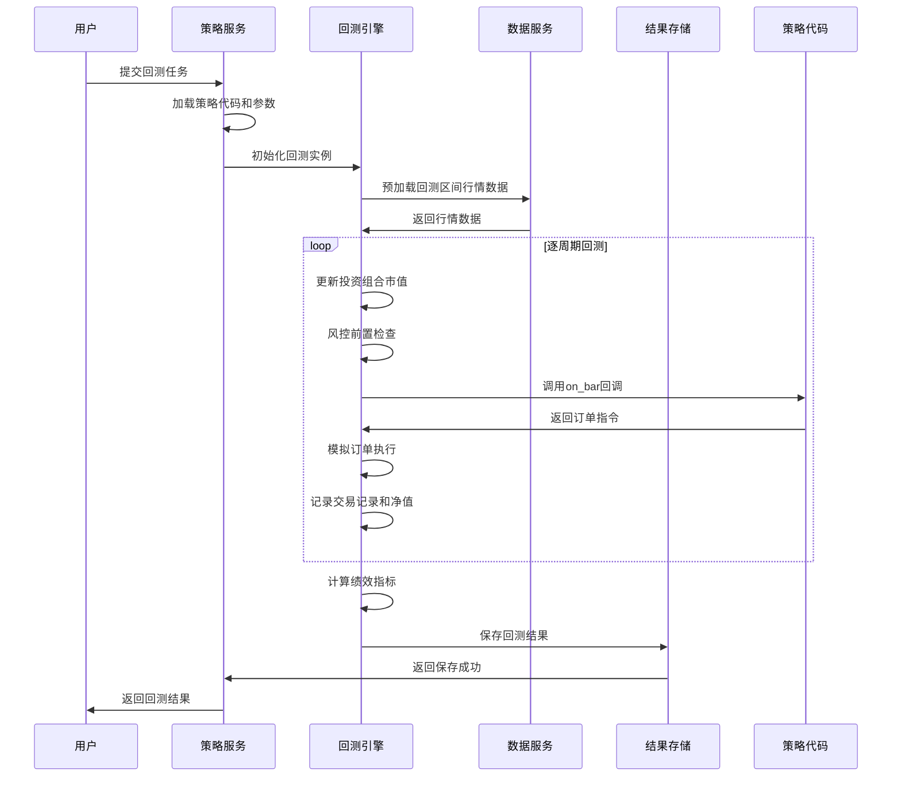
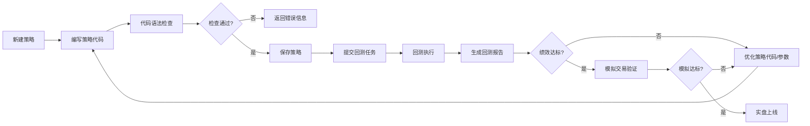

# 策略研究子系统详细设计

## 1. 子系统概述
策略研究子系统是量化交易系统的核心模块，为量化研究员提供策略开发、回测验证、模拟交易、绩效分析的全流程支持，帮助用户快速验证交易策略的有效性。

### 1.1 核心职责
- 策略代码开发和版本管理
- 历史数据回测引擎
- 模拟交易（仿真交易）
- 策略绩效分析和报告生成
- 策略参数优化
- 策略风险评估
- 策略实盘上线前验证

### 1.2 模块划分
```
strategy-research/
├── strategy-management     # 策略管理模块
│   ├── strategy-editor     # 策略编辑器
│   ├── version-manager     # 版本管理
│   └── parameter-optimizer # 参数优化器
├── backtest-engine         # 回测引擎模块
│   ├── data-feeder         # 数据馈送器
│   ├── execution-simulator # 执行模拟器
│   ├── risk-controller     # 回测风控
│   └── performance-analyzer # 绩效分析器
├── simulation-trading      # 模拟交易模块
│   ├── paper-trading-engine # 仿真交易引擎
│   ├── order-simulator     # 订单模拟器
│   └── market-simulator    # 行情模拟器
├── report-generator        # 报告生成模块
│   ├── performance-report  # 绩效报告
│   ├── risk-report         # 风险报告
│   └── visual-chart        # 可视化图表
└── strategy-validator      # 策略验证模块
    ├── code-checker        # 代码安全检查
    ├── compliance-checker  # 合规检查
    └── stress-tester       # 压力测试
```

## 2. 核心类设计
### 2.1 策略管理模块
#### 2.1.1 StrategyBase (策略基类)
```python
from abc import ABC, abstractmethod
from typing import Dict, List, Any
import pandas as pd
import numpy as np
from datetime import datetime

class StrategyBase(ABC):
    """所有策略必须继承的基类"""

    def __init__(self, parameters: Dict = None):
        self.parameters = parameters or {}
        self.context = {}  # 策略运行上下文
        self.portfolio = None  # 投资组合对象
        self.logger = None

    @abstractmethod
    def initialize(self):
        """策略初始化方法，回测开始时调用一次"""
        pass

    @abstractmethod
    def on_bar(self, bar_data: pd.DataFrame):
        """K线数据回调，每个周期调用一次"""
        pass

    @abstractmethod
    def on_tick(self, tick_data: Dict):
        """Tick数据回调，每笔Tick调用一次"""
        pass

    @abstractmethod
    def on_order_filled(self, order: Dict):
        """订单成交回调"""
        pass

    def set_context(self, context: Dict):
        """设置策略上下文"""
        self.context = context

    def get_parameter(self, key: str, default: Any = None) -> Any:
        """获取策略参数"""
        return self.parameters.get(key, default)

    def log(self, message: str, level: str = 'info'):
        """策略日志"""
        if self.logger:
            getattr(self.logger, level)(message)
```

#### 2.1.2 StrategyManager (策略管理器)
```python
from typing import List, Dict
import importlib
import sys
import os
from datetime import datetime

class StrategyManager:
    """策略管理器，负责策略的加载、保存、版本管理"""

    def __init__(self, strategy_store_path: str):
        self.strategy_store_path = strategy_store_path
        self.strategy_cache = {}

    def load_strategy(self, strategy_id: str, version: str = None) -> StrategyBase:
        """加载策略"""
        cache_key = f"{strategy_id}_{version or 'latest'}"
        if cache_key in self.strategy_cache:
            return self.strategy_cache[cache_key]

        # 从数据库或文件系统加载策略代码
        strategy_code = self._get_strategy_code(strategy_id, version)
        strategy_class = self._compile_strategy(strategy_code)

        # 获取策略参数
        parameters = self._get_strategy_parameters(strategy_id, version)
        strategy = strategy_class(parameters)

        self.strategy_cache[cache_key] = strategy
        return strategy

    def save_strategy(self, user_id: int, strategy_name: str, strategy_code: str, parameters: Dict) -> str:
        """保存策略"""
        strategy_id = self._generate_strategy_id()
        version = self._generate_version()

        # 保存策略代码和参数到数据库
        self._save_to_db(strategy_id, version, user_id, strategy_name, strategy_code, parameters)

        # 清理缓存
        cache_key = f"{strategy_id}_latest"
        if cache_key in self.strategy_cache:
            del self.strategy_cache[cache_key]

        return strategy_id

    def list_strategies(self, user_id: int) -> List[Dict]:
        """获取用户的策略列表"""
        return self._query_user_strategies(user_id)

    def get_strategy_versions(self, strategy_id: str) -> List[Dict]:
        """获取策略的版本历史"""
        return self._query_strategy_versions(strategy_id)

    def _compile_strategy(self, code: str) -> type:
        """编译策略代码，返回策略类"""
        # 先进行代码安全扫描
        self._security_scan(code)

        module_name = f"strategy_{datetime.now().strftime('%Y%m%d%H%M%S')}"
        module = importlib.util.module_from_spec(
            importlib.util.spec_from_loader(module_name, loader=None)
        )
        sys.modules[module_name] = module

        # 创建安全的执行环境，拦截危险函数
        safe_globals = self._get_safe_globals()
        safe_globals['__builtins__'] = self._get_safe_builtins()
        exec(code, safe_globals, module.__dict__)

        # 查找继承自StrategyBase的类
        for item in dir(module):
            obj = getattr(module, item)
            if isinstance(obj, type) and issubclass(obj, StrategyBase) and obj != StrategyBase:
                return obj
        raise ValueError("策略代码中未找到有效的StrategyBase子类")

    def _security_scan(self, code: str):
        """代码安全扫描，检测危险函数调用"""
        # 危险函数列表
        dangerous_keywords = [
            'import os', 'import sys', 'import subprocess', 'import socket',
            'open(', 'exec(', 'eval(', 'compile(', 'os.', 'sys.', 'subprocess.',
            'socket.', '__import__', 'globals', 'locals', 'getattr', 'setattr',
            'delattr', 'pickle.', 'marshal.', 'ctypes.', 'threading.', 'multiprocessing.'
        ]
        for keyword in dangerous_keywords:
            if keyword in code:
                raise ValueError(f"策略代码包含危险关键字：{keyword}，不允许执行")

    def _get_safe_builtins(self) -> Dict:
        """返回安全的内置函数列表"""
        safe_builtins = {}
        allowed_builtins = [
            'abs', 'all', 'any', 'bool', 'float', 'int', 'len', 'list', 'dict',
            'max', 'min', 'range', 'str', 'sum', 'tuple', 'set', 'round', 'sorted',
            'zip', 'enumerate', 'filter', 'map', 'next', 'reversed'
        ]
        for name in allowed_builtins:
            safe_builtins[name] = __builtins__[name]
        return safe_builtins

    def _get_safe_globals(self) -> Dict:
        """返回安全的全局变量"""
        return {
            'pd': pd,  # 允许使用pandas
            'np': np,  # 允许使用numpy
            'StrategyBase': StrategyBase,
            'datetime': datetime,
            'timedelta': timedelta
        }

    def _run_strategy_in_sandbox(self, strategy, *args, **kwargs):
        """在沙箱中运行策略，限制资源使用"""
        import resource
        import signal

        # 限制CPU时间为180秒
        resource.setrlimit(resource.RLIMIT_CPU, (180, 180))
        # 限制内存使用为4GB
        resource.setrlimit(resource.RLIMIT_AS, (4 * 1024 * 1024 * 1024, 4 * 1024 * 1024 * 1024))
        # 限制文件大小为100MB
        resource.setrlimit(resource.RLIMIT_FSIZE, (100 * 1024 * 1024, 100 * 1024 * 1024))

        # 超时处理
        def timeout_handler(signum, frame):
            raise TimeoutError("策略执行超时")
        signal.signal(signal.SIGALRM, timeout_handler)
        signal.alarm(180)

        try:
            result = strategy(*args, **kwargs)
            return result
        finally:
            signal.alarm(0)
```

### 2.2 回测引擎模块
#### 2.2.1 BacktestEngine (回测引擎)
```python
from typing import Dict, List
import pandas as pd
import numpy as np
from datetime import datetime, timedelta
from concurrent.futures import ProcessPoolExecutor

class BacktestEngine:
    """回测引擎核心类"""

    def __init__(self, config: Dict):
        self.config = config
        self.data_feeder = None
        self.execution_simulator = None
        self.risk_controller = None
        self.performance_analyzer = None
        self.strategy = None
        self.results = {}

    def initialize(self, strategy, start_date: str, end_date: str, initial_capital: float):
        """初始化回测"""
        self.strategy = strategy
        self.start_date = datetime.strptime(start_date, '%Y-%m-%d')
        self.end_date = datetime.strptime(end_date, '%Y-%m-%d')
        self.initial_capital = initial_capital

        # 初始化各个组件
        self._init_components()

        # 初始化策略
        self.strategy.initialize()

    def run(self) -> Dict:
        """执行回测"""
        # 预加载数据
        all_data = self.data_feeder.load_data(self.start_date, self.end_date)

        # 按时间顺序遍历数据
        for current_time, bar_data in all_data.iterrows():
            # 更新投资组合市值
            self.portfolio.update_market_value(bar_data)

            # 风控检查
            if not self.risk_controller.pre_trade_check(self.strategy.context, self.portfolio):
                continue

            # 调用策略回调
            self.strategy.on_bar(bar_data)

            # 处理订单
            self.execution_simulator.process_orders(current_time, bar_data)

            # 记录净值
            self._record_net_value(current_time)

        # 计算绩效指标
        self.results = self.performance_analyzer.calculate(self.portfolio, self.trade_records)
        return self.results

    def run_optimization(self, parameter_ranges: Dict, max_workers: int = 4) -> List[Dict]:
        """参数优化，并行执行多组参数回测"""
        parameter_combinations = self._generate_parameter_combinations(parameter_ranges)
        results = []

        with ProcessPoolExecutor(max_workers=max_workers) as executor:
            futures = [
                executor.submit(self._run_single_backtest, params)
                for params in parameter_combinations
            ]
            for future in futures:
                results.append(future.result())

        return sorted(results, key=lambda x: x['sharpe_ratio'], reverse=True)

    def _run_single_backtest(self, parameters: Dict) -> Dict:
        """运行单组参数回测"""
        strategy = self.strategy.__class__(parameters)
        engine = BacktestEngine(self.config)
        engine.initialize(strategy, self.start_date.strftime('%Y-%m-%d'),
                         self.end_date.strftime('%Y-%m-%d'), self.initial_capital)
        return engine.run()
```

#### 2.2.2 PerformanceAnalyzer (绩效分析器)
```python
import pandas as pd
import numpy as np
from typing import Dict, List

class PerformanceAnalyzer:
    """绩效分析器，计算各种回测指标"""

    @staticmethod
    def calculate(portfolio, trade_records: List[Dict]) -> Dict:
        """计算所有绩效指标"""
        net_value_series = pd.Series(portfolio.net_value_history)
        returns = net_value_series.pct_change().dropna()

        return {
            'total_return': PerformanceAnalyzer._calculate_total_return(portfolio.initial_capital, portfolio.current_capital),
            'annualized_return': PerformanceAnalyzer._calculate_annualized_return(returns),
            'sharpe_ratio': PerformanceAnalyzer._calculate_sharpe_ratio(returns),
            'max_drawdown': PerformanceAnalyzer._calculate_max_drawdown(net_value_series),
            'win_rate': PerformanceAnalyzer._calculate_win_rate(trade_records),
            'profit_factor': PerformanceAnalyzer._calculate_profit_factor(trade_records),
            'total_trades': len(trade_records),
            'average_profit_per_trade': PerformanceAnalyzer._calculate_avg_profit_per_trade(trade_records),
            'max_consecutive_wins': PerformanceAnalyzer._calculate_max_consecutive(trade_records, 'win'),
            'max_consecutive_losses': PerformanceAnalyzer._calculate_max_consecutive(trade_records, 'loss'),
            'calmar_ratio': PerformanceAnalyzer._calculate_calmar_ratio(returns, net_value_series),
            'sortino_ratio': PerformanceAnalyzer._calculate_sortino_ratio(returns),
            'volatility': PerformanceAnalyzer._calculate_volatility(returns)
        }

    @staticmethod
    def _calculate_total_return(initial: float, current: float) -> float:
        """计算总收益率"""
        return (current - initial) / initial if initial > 0 else 0

    @staticmethod
    def _calculate_annualized_return(returns: pd.Series) -> float:
        """计算年化收益率"""
        if len(returns) == 0:
            return 0
        return (1 + returns.mean()) ** 252 - 1  # 252个交易日

    @staticmethod
    def _calculate_sharpe_ratio(returns: pd.Series, risk_free_rate: float = 0.03) -> float:
        """计算夏普比率"""
        if len(returns) == 0 or returns.std() == 0:
            return 0
        excess_return = returns.mean() * 252 - risk_free_rate
        return excess_return / (returns.std() * np.sqrt(252))

    @staticmethod
    def _calculate_max_drawdown(net_value: pd.Series) -> float:
        """计算最大回撤"""
        if len(net_value) == 0:
            return 0
        peak = net_value.cummax()
        drawdown = (net_value - peak) / peak
        return drawdown.min() * -1
```

## 3. 接口详细设计
### 3.1 REST API接口
#### 3.1.1 创建策略接口
- **路径**：`POST /api/v1/strategy/create`
- **功能**：创建新策略
- **请求参数**：
  ```json
  {
    "strategy_name": "双均线策略",
    "strategy_code": "class MyStrategy(StrategyBase):\n    def initialize(self):\n        pass\n    def on_bar(self, data):\n        pass",
    "parameters": {
        "fast_period": 5,
        "slow_period": 20
    },
    "description": "基于均线金叉死叉的趋势策略"
  }
  ```
- **返回结果**：
  ```json
  {
    "code": 200,
    "message": "success",
    "data": {
      "strategy_id": "STR000001",
      "version": "v1.0",
      "created_at": "2026-03-28 14:00:00"
    },
    "request_id": "xxx",
    "timestamp": 1711605600
  }
  ```

#### 3.1.2 运行回测接口
- **路径**：`POST /api/v1/strategy/{strategy_id}/backtest`
- **功能**：提交回测任务
- **请求参数**：
  ```json
  {
    "start_date": "2023-01-01",
    "end_date": "2023-12-31",
    "initial_capital": 100000,
    "parameters": {
        "fast_period": 5,
        "slow_period": 20
    },
    "benchmark": "000300.SH"
  }
  ```
- **返回结果**：
  ```json
  {
    "code": 200,
    "message": "success",
    "data": {
      "task_id": "BACKTEST000001",
      "status": "pending",
      "estimated_time": 60
    },
    "request_id": "xxx",
    "timestamp": 1711605600
  }
  ```

#### 3.1.3 获取回测结果接口
- **路径**：`GET /api/v1/backtest/{task_id}/result`
- **功能**：获取回测任务结果
- **返回结果**：
  ```json
  {
    "code": 200,
    "message": "success",
    "data": {
      "task_id": "BACKTEST000001",
      "status": "completed",
      "performance": {
        "total_return": 0.256,
        "annualized_return": 0.256,
        "sharpe_ratio": 1.85,
        "max_drawdown": 0.087,
        "win_rate": 0.62,
        "profit_factor": 1.76,
        "total_trades": 86
      },
      "net_value_curve": [
        {"date": "2023-01-01", "value": 100000},
        {"date": "2023-12-31", "value": 125600}
      ],
      "trade_records": [
        {
          "trade_time": "2023-01-05 09:30:00",
          "stock_code": "600000.SH",
          "trade_type": "buy",
          "price": 12.34,
          "quantity": 1000,
          "profit": 0
        }
      ],
      "report_url": "/reports/backtest/BACKTEST000001.pdf"
    },
    "request_id": "xxx",
    "timestamp": 1711605600
  }
  ```

#### 3.1.4 启动模拟交易接口
- **路径**：`POST /api/v1/strategy/{strategy_id}/simulation/start`
- **功能**：启动模拟交易
- **请求参数**：
  ```json
  {
    "initial_capital": 100000,
    "parameters": {
        "fast_period": 5,
        "slow_period": 20
    }
  }
  ```

### 3.2 内部gRPC接口
```proto
syntax = "proto3";

package strategy;

service StrategyService {
  // 创建策略
  rpc CreateStrategy(CreateStrategyRequest) returns (CreateStrategyResponse);
  // 运行回测
  rpc RunBacktest(RunBacktestRequest) returns (RunBacktestResponse);
  // 查询回测状态
  rpc GetBacktestStatus(GetBacktestStatusRequest) returns (GetBacktestStatusResponse);
  // 获取回测结果
  rpc GetBacktestResult(GetBacktestResultRequest) returns (GetBacktestResultResponse);
  // 启动模拟交易
  rpc StartSimulation(StartSimulationRequest) returns (StartSimulationResponse);
  // 停止模拟交易
  rpc StopSimulation(StopSimulationRequest) returns (StopSimulationResponse);
}

message CreateStrategyRequest {
  int64 user_id = 1;
  string strategy_name = 2;
  string strategy_code = 3;
  map<string, string> parameters = 4;
  string description = 5;
}

message RunBacktestRequest {
  string strategy_id = 1;
  string start_date = 2;
  string end_date = 3;
  double initial_capital = 4;
  map<string, string> parameters = 5;
  string benchmark = 6;
}
```

## 4. 业务流程设计
### 4.1 回测执行流程


### 4.2 策略开发流程


## 5. 数据库表结构详细设计
### 5.1 PostgreSQL表结构
#### 5.1.1 策略基本信息表
```sql
CREATE TABLE strategies (
    strategy_id VARCHAR(20) PRIMARY KEY,
    user_id BIGINT NOT NULL,
    strategy_name VARCHAR(100) NOT NULL,
    description TEXT,
    strategy_type SMALLINT NOT NULL, -- 1:趋势 2:均值回归 3:套利 4:高频 5:其他
    status SMALLINT DEFAULT 0, -- 0:草稿 1:测试中 2:已上线 3:已下线
    created_at TIMESTAMP DEFAULT CURRENT_TIMESTAMP,
    updated_at TIMESTAMP DEFAULT CURRENT_TIMESTAMP,
    FOREIGN KEY (user_id) REFERENCES users(user_id)
);

CREATE INDEX idx_strategy_user ON strategies(user_id);
```

#### 5.1.2 策略版本表
```sql
CREATE TABLE strategy_versions (
    version_id BIGSERIAL PRIMARY KEY,
    strategy_id VARCHAR(20) NOT NULL,
    version VARCHAR(20) NOT NULL,
    strategy_code TEXT NOT NULL,
    parameters JSONB NOT NULL,
    commit_message TEXT,
    created_by BIGINT NOT NULL,
    created_at TIMESTAMP DEFAULT CURRENT_TIMESTAMP,
    FOREIGN KEY (strategy_id) REFERENCES strategies(strategy_id),
    UNIQUE(strategy_id, version)
);

CREATE INDEX idx_strategy_version ON strategy_versions(strategy_id);
```

#### 5.1.3 回测任务表
```sql
CREATE TABLE backtest_tasks (
    task_id VARCHAR(32) PRIMARY KEY,
    strategy_id VARCHAR(20) NOT NULL,
    version VARCHAR(20) NOT NULL,
    start_date DATE NOT NULL,
    end_date DATE NOT NULL,
    initial_capital DECIMAL(18,2) NOT NULL,
    parameters JSONB NOT NULL,
    benchmark VARCHAR(20),
    status SMALLINT DEFAULT 0, -- 0:排队中 1:执行中 2:已完成 3:失败
    progress INTEGER DEFAULT 0, -- 进度百分比
    performance JSONB, -- 绩效指标
    error_message TEXT,
    started_at TIMESTAMP,
    completed_at TIMESTAMP,
    duration INTEGER, -- 执行时间(秒)
    created_at TIMESTAMP DEFAULT CURRENT_TIMESTAMP,
    FOREIGN KEY (strategy_id) REFERENCES strategies(strategy_id)
);

CREATE INDEX idx_backtest_strategy ON backtest_tasks(strategy_id);
CREATE INDEX idx_backtest_status ON backtest_tasks(status);
```

#### 5.1.4 回测交易记录表
```sql
CREATE TABLE backtest_trades (
    trade_id BIGSERIAL PRIMARY KEY,
    task_id VARCHAR(32) NOT NULL,
    trade_time TIMESTAMP NOT NULL,
    stock_code VARCHAR(10) NOT NULL,
    trade_type SMALLINT NOT NULL, -- 1:买入 2:卖出
    price DECIMAL(10,2) NOT NULL,
    quantity INTEGER NOT NULL,
    amount DECIMAL(18,2) NOT NULL,
    profit DECIMAL(18,2) DEFAULT 0,
    commission DECIMAL(18,2) DEFAULT 0,
    created_at TIMESTAMP DEFAULT CURRENT_TIMESTAMP,
    FOREIGN KEY (task_id) REFERENCES backtest_tasks(task_id)
);

CREATE INDEX idx_backtest_trade_task ON backtest_trades(task_id);
```

#### 5.1.5 模拟交易账户表
```sql
CREATE TABLE simulation_accounts (
    account_id BIGSERIAL PRIMARY KEY,
    user_id BIGINT NOT NULL,
    strategy_id VARCHAR(20) NOT NULL,
    initial_capital DECIMAL(18,2) NOT NULL,
    current_capital DECIMAL(18,2) NOT NULL,
    available_cash DECIMAL(18,2) NOT NULL,
    total_profit DECIMAL(18,2) DEFAULT 0,
    status SMALLINT DEFAULT 0, -- 0:运行中 1:已停止
    started_at TIMESTAMP NOT NULL,
    stopped_at TIMESTAMP,
    created_at TIMESTAMP DEFAULT CURRENT_TIMESTAMP,
    FOREIGN KEY (user_id) REFERENCES users(user_id),
    FOREIGN KEY (strategy_id) REFERENCES strategies(strategy_id)
);
```

## 6. 异常处理设计
### 6.1 异常类型
| 异常类型 | 说明 | 处理策略 |
|----------|------|----------|
| StrategyCompilationError | 策略代码编译错误 | 返回详细的错误信息和行号，帮助用户定位问题 |
| StrategyRuntimeError | 策略运行时异常 | 记录错误日志，终止回测，返回错误栈信息 |
| BacktestDataError | 回测数据缺失或错误 | 提示用户补充数据或调整回测区间 |
| ParameterValidationError | 参数验证失败 | 返回参数错误信息和有效值范围 |
| ResourceLimitExceededError | 回测资源超限 | 提示用户等待或升级套餐，支持队列排队 |

### 6.2 安全设计
- **沙箱隔离**：策略代码在独立的沙箱环境中运行，禁止访问系统资源和网络
- **代码扫描**：自动检测危险函数调用（如os.system、subprocess等）
- **资源限制**：每个回测任务限制CPU、内存和运行时间，防止资源耗尽
- **权限隔离**：用户只能访问自己的策略和回测结果

## 7. 单元测试用例要点
### 7.1 策略管理模块
- 测试策略代码的编译和加载功能
- 测试策略版本管理和回滚功能
- 测试参数优化的并行执行功能
- 测试代码安全扫描功能

### 7.2 回测引擎模块
- 测试不同类型策略的回测正确性
- 测试订单模拟执行的准确性
- 测试绩效指标计算的正确性
- 测试回测性能是否满足要求
- 测试参数优化的结果正确性

### 7.3 模拟交易模块
- 测试模拟交易与实盘行情的同步性
- 测试订单撮合逻辑的正确性
- 测试模拟账户资金计算的准确性

## 8. 性能指标
| 指标 | 要求 |
|------|------|
| 简单策略回测速度 | ≤60秒（1年日线数据） |
| 复杂策略回测速度 | ≤180秒（1年日线数据） |
| 回测结果查询响应 | <500毫秒 |
| 单节点支持并发回测任务 | ≥10个 |
| 策略代码编译时间 | <2秒 |
| 绩效指标计算时间 | <1秒 |
