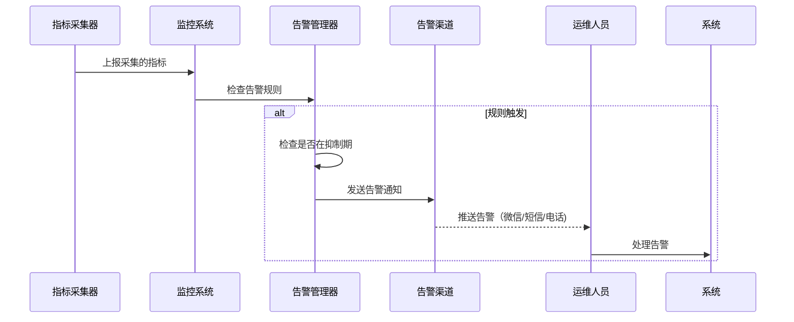
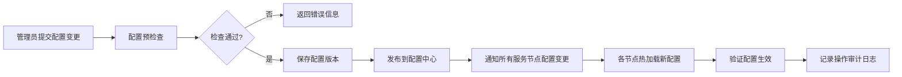

# 系统管理子系统详细设计

## 1. 子系统概述
系统管理子系统是面向运维人员和系统管理员的后台管理模块，负责整个系统的监控、配置、日志、任务调度和运维管理，保障系统的稳定运行。

### 1.1 核心职责
- 系统实时监控和告警
- 系统配置集中管理和发布
- 系统日志收集、审计和查询
- 定时任务调度和管理
- 系统升级和版本管理
- 资源监控和容量规划
- 系统安全审计和合规检查

### 1.2 模块划分
```
system-management/
├── monitoring-center     # 监控中心模块
│   ├── metrics-collector # 指标采集器
│   ├── dashboard       # 监控大盘
│   ├── alert-manager   # 告警管理器
│   └── health-checker # 健康检查器
├── configuration-center # 配置中心模块
│   ├── config-manager  # 配置管理器
│   ├── config-publisher # 配置发布器
│   └── config-version  # 版本管理
├── log-center          # 日志中心模块
│   ├── log-collector   # 日志收集器
│   ├── log-storage     # 日志存储
│   ├── log-query       # 日志查询
│   └── audit-logger # 审计日志
├── task-scheduler      # 任务调度模块
│   ├── job-manager     # 任务管理器
│   ├── job-executor    # 任务执行器
│   └── job-monitor   # 任务监控
└── operation-tools       # 运维工具模块
    ├── system-upgrader # 系统升级工具
    ├── backup-restore  # 备份恢复工具
    └── resource-manager # 资源管理器
```

## 2. 核心类设计
### 2.1 监控中心模块
#### 2.1.1 MetricsCollector (指标采集器)
```python
from typing import Dict, List
from datetime import datetime
import psutil
import time
from prometheus_client import Gauge, Counter, Histogram

class MetricsCollector:
    """系统指标采集器，支持多维度指标采集"""

    def __init__(self):
        # 系统指标
        self.cpu_usage = Gauge('system_cpu_usage', 'CPU使用率', ['host'])
        self.memory_usage = Gauge('system_memory_usage', '内存使用率', ['host'])
        self.disk_usage = Gauge('system_disk_usage', '磁盘使用率', ['host', 'mount'])
        self.network_in = Counter('system_network_in_bytes', '入站流量', ['host', 'interface'])
        self.network_out = Counter('system_network_out_bytes', '出站流量', ['host', 'interface'])

        # 业务指标
        self.order_count = Counter('trade_order_total', '订单总数', ['broker'])
        self.order_latency = Histogram('trade_order_latency_ms', '订单处理延迟', ['order_type'])
        self.backtest_count = Counter('strategy_backtest_total', '回测任务总数', ['status'])
        self.api_request_count = Counter('api_request_total', 'API请求总数', ['endpoint', 'status'])

        self.hostname = self._get_hostname()
        self.running = False

    def start(self, interval: int = 10):
        """启动指标采集"""
        self.running = True
        while self.running:
            self._collect_system_metrics()
            self._collect_business_metrics()
            time.sleep(interval)

    def _collect_system_metrics(self):
        """采集系统指标"""
        # CPU使用率
        cpu_percent = psutil.cpu_percent(percpu=False)
        self.cpu_usage.labels(host=self.hostname).set(cpu_percent)

        # 内存使用率
        memory = psutil.virtual_memory()
        self.memory_usage.labels(host=self.hostname).set(memory.percent)

        # 磁盘使用率
        for part in psutil.disk_partitions():
            try:
                usage = psutil.disk_usage(part.mountpoint)
                self.disk_usage.labels(host=self.hostname, mount=part.mountpoint).set(usage.percent)
            except PermissionError:
                continue

        # 网络流量
        network = psutil.net_io_counters(pernic=True)
        for interface, stats in network.items():
            self.network_in.labels(host=self.hostname, interface=interface).inc(stats.bytes_recv)
            self.network_out.labels(host=self.hostname, interface=interface).inc(stats.bytes_sent)

    def _collect_business_metrics(self):
        """采集业务指标"""
        # 从各个业务子系统拉取指标
        pass
```

#### 2.1.2 AlertManager (告警管理器)
```python
from typing import Dict, List
from datetime import datetime, timedelta
import requests

class AlertManager:
    """告警管理器，支持多规则告警和通知"""

    def __init__(self, config: Dict):
        self.alert_rules = self._load_rules(config)
        self.alert_history = {}
        self.suppress_interval = timedelta(minutes=10)
        self.notification_channels = config.get('notification_channels', [])

    def check_alerts(self, metrics: Dict):
        """检查告警规则"""
        for rule in self.alert_rules:
            if self._is_rule_triggered(rule, metrics):
                self._process_alert(rule, metrics)

    def _is_rule_triggered(self, rule: Dict, metrics: Dict) -> bool:
        """检查规则是否触发"""
        metric_value = metrics.get(rule['metric'])
        if metric_value is None:
            return False

        operator = rule['operator']
        threshold = rule['threshold']

        if operator == '>':
            return metric_value > threshold
        elif operator == '<':
            return metric_value < threshold
        elif operator == '>=':
            return metric_value >= threshold
        elif operator == '<=':
            return metric_value <= threshold
        elif operator == '==':
            return metric_value == threshold
        return False

    def _process_alert(self, rule: Dict, metrics: Dict):
        """处理触发的告警"""
        alert_key = f"{rule['id']}_{self._get_alert_key(rule, metrics)}"
        # 抑制重复告警
        if alert_key in self.alert_history:
            if datetime.now() - self.alert_history[alert_key] < self.suppress_interval:
                return

        # 发送告警通知
        self._send_alert_notification(rule, metrics)
        self.alert_history[alert_key] = datetime.now()
        # 记录告警事件
        self._record_alert_event(rule, metrics)

    def _send_alert_notification(self, rule: Dict, metrics: Dict):
        """发送告警通知"""
        alert_content = self._build_alert_content(rule, metrics)
        for channel in self.notification_channels:
            if channel['type'] == 'wechat':
                self._send_wechat_alert(channel['webhook'], alert_content)
            elif channel['type'] == 'phone':
                self._send_phone_alert(channel['phones'], alert_content)
            elif channel['type'] == 'email':
                self._send_email_alert(channel['emails'], alert_content)
```

### 2.2 配置中心模块
#### 2.2.1 ConfigManager (配置管理器)
```python
from typing import Dict, List, Optional
from datetime import datetime
import json
import etcd3

class ConfigManager:
    """分布式配置管理器，基于etcd实现配置的集中管理和动态更新"""

    def __init__(self, etcd_host: str = 'localhost', etcd_port: int = 2379):
        self.etcd_client = etcd3.client(host=etcd_host, port=etcd_port)
        self.config_prefix = '/quant/config/'
        self.watch_callbacks = {}

    def get_config(self, key: str, default = None):
        """获取配置"""
        full_key = f"{self.config_prefix}{key}"
        value, _ = self.etcd_client.get(full_key)
        if value is None:
            return default
        return json.loads(value.decode('utf-8'))

    def set_config(self, key: str, value, operator: str = 'system'):
        """设置配置"""
        full_key = f"{self.config_prefix}{key}"
        # 保存版本历史
        self._save_version(key, value, operator)
        # 写入etcd
        self.etcd_client.put(full_key, json.dumps(value).encode('utf-8'))
        # 触发配置变更事件
        self._notify_config_change(key, value)

    def watch_config(self, key: str, callback):
        """监听配置变更"""
        full_key = f"{self.config_prefix}{key}"
        self.watch_callbacks[key] = callback
        # 启动异步监听
        self.etcd_client.add_watch_callback(full_key, self._watch_handler)

    def _watch_handler(self, event):
        """配置变更事件处理"""
        key = event.key.decode('utf-8').replace(self.config_prefix, '')
        value = json.loads(event.value.decode('utf-8'))
        if key in self.watch_callbacks:
            self.watch_callbacks[key](key, value)

    def list_configs(self) -> List[Dict]:
        """列出所有配置"""
        configs = []
        for value, metadata in self.etcd_client.get_prefix(self.config_prefix):
            key = metadata.key.decode('utf-8').replace(self.config_prefix, '')
            configs.append({
                'key': key,
                'value': json.loads(value.decode('utf-8')),
                'version': self._get_latest_version(key)
            })
        return configs
```

### 2.3 任务调度模块
#### 2.3.1 TaskScheduler (任务调度器)
```python
from typing import Dict, List
from datetime import datetime
from apscheduler.schedulers.asyncio import AsyncIOScheduler
from apscheduler.triggers.cron import CronTrigger
from apscheduler.triggers.interval import IntervalTrigger
from apscheduler.triggers.date import DateTrigger
import asyncio

class TaskScheduler:
    """分布式任务调度器，支持定时任务和异步任务"""

    def __init__(self):
        self.scheduler = AsyncIOScheduler(timezone="Asia/Shanghai")
        self.task_registry = {}
        self.running = False

    def register_task(self, task_id: str, task_func, cron_exp: str = None, interval: int = None, run_date: datetime = None):
        """注册任务"""
        trigger = None
        if cron_exp:
            trigger = CronTrigger.from_crontab(cron_exp)
        elif interval:
            trigger = IntervalTrigger(seconds=interval)
        elif run_date:
            trigger = DateTrigger(run_date=run_date)

        if trigger:
            self.scheduler.add_job(
                task_func,
                trigger=trigger,
                id=task_id,
                replace_existing=True
            )
        self.task_registry[task_id] = {
                'func': task_func,
                'cron_exp': cron_exp,
                'interval': interval,
                'run_date': run_date,
                'status': 'registered'
            }

    def start(self):
        """启动调度器"""
        if not self.running:
            self.scheduler.start()
            self.running = True

    def stop(self):
        """停止调度器"""
        if self.running:
            self.scheduler.shutdown()
            self.running = False

    def run_task_now(self, task_id: str) -> str:
        """立即执行任务"""
        if task_id not in self.task_registry:
            raise ValueError(f"任务{task_id}不存在")
        job = self.scheduler.modify_job(task_id, next_run_time=datetime.now())
        return job.id

    def get_task_status(self, task_id: str) -> Dict:
        """获取任务状态"""
        job = self.scheduler.get_job(task_id)
        if not job:
            return {'status': 'not_found'}
        return {
            'task_id': task_id,
            'status': 'running' if job.next_run_time else 'paused',
            'next_run_time': job.next_run_time,
            'last_run_time': job.last_run_time
        }

    def pause_task(self, task_id: str):
        """暂停任务"""
        self.scheduler.pause_job(task_id)
        self.task_registry[task_id]['status'] = 'paused'

    def resume_task(self, task_id: str):
        """恢复任务"""
        self.scheduler.resume_job(task_id)
        self.task_registry[task_id]['status'] = 'running'

    # 内置系统任务
    def _register_system_tasks(self):
        """注册系统内置任务"""
        # 每日数据同步任务
        self.register_task('daily_data_sync', self._daily_data_sync, cron_exp='0 0 1 * * ?')
        # 系统健康检查任务
        self.register_task('system_health_check', self._health_check, interval=60)
        # 日志清理任务
        self.register_task('log_cleanup', self._log_cleanup, cron_exp='0 0 2 * * ?')
        # 数据库备份任务
        self.register_task('db_backup', self._db_backup, cron_exp='0 0 3 * * ?')
```

## 3. 接口详细设计
### 3.1 REST API接口（仅管理员可访问）
#### 3.1.1 获取系统状态接口
- **路径**：`GET /api/v1/system/status`
- **功能**：获取系统整体运行状态
- **返回结果**：
  ```json
  {
    "code": 200,
    "message": "success",
    "data": {
      "system_status": "healthy",
      "cpu_usage": 25.6,
      "memory_usage": 42.3,
      "disk_usage": 68.2,
      "running_tasks": 12,
      "total_users": 256,
      "active_connections": 189,
      "uptime": 86400,
      "version": "v1.1.0",
      "last_alert_time": "2026-03-28 10:30:00"
    },
    "request_id": "xxx",
    "timestamp": 1711605600
  }
  ```

#### 3.1.2 配置管理接口
- **获取配置**：`GET /api/v1/system/config/{key}`
- **更新配置**：`PUT /api/v1/system/config/{key}`
- **请求参数（更新配置）**：
  ```json
  {
    "value": {
      "max_order_per_minute": 1000,
      "risk_check_enabled": true
    },
    "remark": "调整订单限流配置调整"
  }
  ```

#### 3.1.3 日志查询接口
- **路径**：`GET /api/v1/system/logs`
- **请求参数**：
  | 参数名 | 类型 | 是否必填 | 说明 |
  |--------|------|----------|------|
  | start_time | String | 是 | 开始时间 |
  | end_time | String | 是 | 结束时间 |
  | level | String | 否 | 日志级别（info/warn/error） |
  | service | String | 否 | 服务名称 |
  | keyword | String | 否 | 搜索关键词 |
  | page | Integer | 否 | 页码 |
  | page_size | Integer | 否 | 每页大小 |

#### 3.1.4 任务管理接口
- 获取任务列表：`GET /api/v1/system/tasks`
- 执行任务：`POST /api/v1/system/tasks/{task_id}/run`
- 暂停任务：`POST /api/v1/system/tasks/{task_id}/pause`
- 恢复任务：`POST /api/v1/system/tasks/{task_id}/resume`

## 4. 业务流程设计
### 4.1 系统监控告警流程


### 4.2 配置发布流程


## 5. 数据库表结构详细设计
### 5.1 PostgreSQL表结构
#### 5.1.1 系统配置表
```sql
CREATE TABLE system_configs (
    config_id BIGSERIAL PRIMARY KEY,
    config_key VARCHAR(100) UNIQUE NOT NULL,
    config_value JSONB NOT NULL,
    config_type VARCHAR(20) NOT NULL,
    description TEXT,
    created_by BIGINT NOT NULL,
    created_at TIMESTAMP DEFAULT CURRENT_TIMESTAMP,
    updated_at TIMESTAMP DEFAULT CURRENT_TIMESTAMP
);
```

#### 5.1.2 配置版本历史表
```sql
CREATE TABLE config_versions (
    version_id BIGSERIAL PRIMARY KEY,
    config_key VARCHAR(100) NOT NULL,
    config_value JSONB NOT NULL,
    version VARCHAR(50) NOT NULL,
    change_remark TEXT,
    operator BIGINT NOT NULL,
    created_at TIMESTAMP DEFAULT CURRENT_TIMESTAMP,
    FOREIGN KEY (config_key) REFERENCES system_configs(config_key)
);
```

#### 5.1.3 系统操作审计表
```sql
CREATE TABLE operation_audit_logs (
    log_id BIGSERIAL PRIMARY KEY,
    user_id BIGINT NOT NULL,
    operation_type VARCHAR(50) NOT NULL,
    resource_type VARCHAR(50) NOT NULL,
    resource_id VARCHAR(100),
    operation_detail JSONB,
    ip_address VARCHAR(50),
    user_agent TEXT,
    status SMALLINT NOT NULL, -- 0:失败 1:成功
    created_at TIMESTAMP DEFAULT CURRENT_TIMESTAMP,
    FOREIGN KEY (user_id) REFERENCES users(user_id)
);

CREATE INDEX idx_audit_log_time ON operation_audit_logs(created_at);
CREATE INDEX idx_audit_log_user ON operation_audit_logs(user_id);
```

#### 5.1.4 定时任务表
```sql
CREATE TABLE scheduled_tasks (
    task_id VARCHAR(50) PRIMARY KEY,
    task_name VARCHAR(100) NOT NULL,
    task_type VARCHAR(20) NOT NULL, -- cron/interval/date
    cron_expression VARCHAR(100),
    interval_seconds INTEGER,
    run_date TIMESTAMP,
    task_params JSONB,
    status SMALLINT DEFAULT 1, -- 0:停止 1:运行
    last_run_time TIMESTAMP,
    next_run_time TIMESTAMP,
    last_run_result TEXT,
    created_at TIMESTAMP DEFAULT CURRENT_TIMESTAMP,
    updated_at TIMESTAMP DEFAULT CURRENT_TIMESTAMP
);
```

#### 5.1.5 告警规则表
```sql
CREATE TABLE alert_rules (
    rule_id VARCHAR(20) PRIMARY KEY,
    rule_name VARCHAR(100) NOT NULL,
    metric_name VARCHAR(100) NOT NULL,
    operator VARCHAR(10) NOT NULL,
    threshold DECIMAL(18,2) NOT NULL,
    level VARCHAR(20) NOT NULL, -- info/warning/error/critical
    notification_channels JSONB NOT NULL,
    enabled BOOLEAN DEFAULT true,
    description TEXT,
    created_at TIMESTAMP DEFAULT CURRENT_TIMESTAMP,
    updated_at TIMESTAMP DEFAULT CURRENT_TIMESTAMP
);
```

## 6. 异常处理设计
### 6.1 异常类型
| 异常类型 | 说明 | 处理策略 |
|----------|------|----------|
| ConfigPublishError | 配置发布失败 | 自动回滚到上一版本，通知管理员 |
| TaskExecutionError | 任务执行失败 | 记录错误日志，根据重试配置自动重试，失败告警 |
| SystemHealthCheckFailedError | 健康检查失败 | 自动隔离故障节点，流量切换到正常节点 |
| PermissionDeniedError | 无系统管理权限 | 返回403错误，记录审计日志 |

### 6.2 高可用设计
- 配置中心多节点部署，etcd集群保障配置高可用
- 任务调度器采用分布式锁，避免任务重复执行
- 监控采集器多实例部署，避免单点故障
- 所有系统操作全部记录审计日志，可追溯可审计

## 7. 单元测试用例要点
### 7.1 监控中心
- 测试系统指标采集的准确性
- 测试告警规则判断正确性
- 测试告警通知渠道可用性
- 测试健康检查功能正确性

### 7.2 配置中心
- 测试配置读写正确性
- 测试配置变更监听和热加载功能
- 测试配置版本管理和回滚功能
- 测试配置发布的原子性

### 7.3 任务调度
- 测试各类定时任务的调度正确性
- 测试任务并发执行无冲突
- 测试任务失败重试机制
- 测试分布式锁功能正确性

## 8. 性能指标
| 指标 | 要求 |
|------|------|
| 指标采集延迟 | <1秒 |
| 配置变更生效时间 | <5秒 |
| 告警推送延迟 | <10秒 |
| 日志查询响应时间 | <2秒（1亿条日志规模 |
| 任务调度误差 | <1秒 |
| 系统监控页面响应时间 | <1秒 |
| 系统可用性 | 99.99% |
