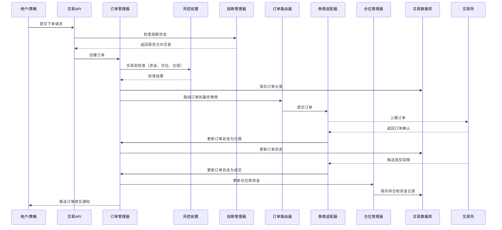
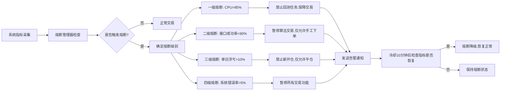

# 交易引擎子系统详细设计

## 1. 子系统概述
交易引擎子系统是量化交易系统的核心交易模块，负责实盘交易的订单路由、执行、仓位管理、券商接口对接，是连接策略和实盘市场的核心枢纽，要求极低延迟和极高可靠性。

### 1.1 核心职责
- 订单生命周期管理（创建、上报、成交、撤销）
- 订单路由和智能算法交易
- 多券商接口对接和管理
- 实时仓位管理和资金计算
- 交易熔断和风险控制
- 交易流水记录和对账
- 交易绩效实时统计

### 1.2 设计目标
- **低延迟**：订单处理平均延迟<10ms，99分位延迟<50ms
- **高可用**：核心交易模块99.99%可用性，无单点故障
- **一致性**：资金和仓位数据强一致性，零差错
- **扩展性**：支持快速接入新的券商接口和交易通道
- **可观测性**：全链路交易追踪，完整审计日志

### 1.3 模块划分
```
trading-engine/
├── order-management      # 订单管理模块
│   ├── order-router      # 订单路由器
│   ├── order-scheduler   # 订单调度器
│   └── order-tracker     # 订单状态跟踪器
├── execution-engine      # 执行引擎模块
│   ├── algo-executor     # 算法执行器
│   ├── trade-allocator   # 交易量分配器
│   └── slippage-calculator # 滑点计算器
├── position-management   # 仓位管理模块
│   ├── position-calculator # 仓位计算器
│   ├── fund-manager      # 资金管理器
│   └── pnl-calculator    # 盈亏计算器
├── broker-adapter        # 券商对接模块
│   ├── ctp-adapter       # CTP接口适配器
│   ├── pb-adapter        # PB接口适配器
│   ├── openapi-adapter   # 券商开放API适配器
│   └── broker-failover   # 券商故障转移
├── risk-control          # 风控前置模块
│   ├── pre-trade-check   # 交易前检查
│   ├── circuit-breaker   # 熔断管理器
│   └── flow-controller   # 流量控制器
└── trade-record          # 交易记录模块
    ├── trade-book        # 交易账本
    ├── reconciliation    # 对账处理器
    └── audit-logger      # 审计日志
```

## 2. 核心类设计
### 2.1 订单管理模块
#### 2.1.1 IdGenerator (全局唯一ID生成器)
```python
import time
import socket
import struct

class SnowflakeIdGenerator:
    """雪花算法ID生成器，保证全局唯一，支持分布式部署"""

    def __init__(self, worker_id: int = None, datacenter_id: int = None):
        # 起始时间戳（2023-01-01）
        self.START_TIMESTAMP = 1672502400000

        # 各部分位数
        self.WORKER_ID_BITS = 5
        self.DATACENTER_ID_BITS = 5
        self.SEQUENCE_BITS = 12

        # 最大值
        self.MAX_WORKER_ID = -1 ^ (-1 << self.WORKER_ID_BITS)
        self.MAX_DATACENTER_ID = -1 ^ (-1 << self.DATACENTER_ID_BITS)

        # 位移
        self.WORKER_ID_SHIFT = self.SEQUENCE_BITS
        self.DATACENTER_ID_SHIFT = self.SEQUENCE_BITS + self.WORKER_ID_BITS
        self.TIMESTAMP_SHIFT = self.SEQUENCE_BITS + self.WORKER_ID_BITS + self.DATACENTER_ID_BITS

        # 序列号掩码
        self.SEQUENCE_MASK = -1 ^ (-1 << self.SEQUENCE_BITS)

        # 如果没有传入worker_id和datacenter_id，自动生成
        if worker_id is None:
            worker_id = self._get_worker_id()
        if datacenter_id is None:
            datacenter_id = self._get_datacenter_id()

        if worker_id > self.MAX_WORKER_ID or worker_id < 0:
            raise ValueError(f"Worker ID不能超过{self.MAX_WORKER_ID}")
        if datacenter_id > self.MAX_DATACENTER_ID or datacenter_id < 0:
            raise ValueError(f"Datacenter ID不能超过{self.MAX_DATACENTER_ID}")

        self.worker_id = worker_id
        self.datacenter_id = datacenter_id
        self.sequence = 0
        self.last_timestamp = -1

    def generate_id(self) -> int:
        """生成全局唯一ID"""
        timestamp = self._get_current_timestamp()

        if timestamp < self.last_timestamp:
            raise RuntimeError("时钟回拨，无法生成ID")

        if timestamp == self.last_timestamp:
            self.sequence = (self.sequence + 1) & self.SEQUENCE_MASK
            if self.sequence == 0:
                timestamp = self._wait_next_millis(self.last_timestamp)
        else:
            self.sequence = 0

        self.last_timestamp = timestamp

        return ((timestamp - self.START_TIMESTAMP) << self.TIMESTAMP_SHIFT) | \
               (self.datacenter_id << self.DATACENTER_ID_SHIFT) | \
               (self.worker_id << self.WORKER_ID_SHIFT) | \
               self.sequence

    def generate_order_id(self) -> str:
        """生成订单ID，前缀为ORD"""
        return f"ORD{self.generate_id()}"

    def generate_request_id(self) -> str:
        """生成请求ID，用于幂等性控制"""
        return f"REQ{self.generate_id()}"

    def _get_current_timestamp(self) -> int:
        return int(time.time() * 1000)

    def _wait_next_millis(self, last_timestamp: int) -> int:
        timestamp = self._get_current_timestamp()
        while timestamp <= last_timestamp:
            timestamp = self._get_current_timestamp()
        return timestamp

    def _get_worker_id(self) -> int:
        """根据主机名生成worker_id"""
        hostname = socket.gethostname()
        return hash(hostname) % self.MAX_WORKER_ID

    def _get_datacenter_id(self) -> int:
        """根据IP地址生成datacenter_id"""
        s = socket.socket(socket.AF_INET, socket.SOCK_DGRAM)
        try:
            s.connect(('10.255.255.255', 1))
            ip = s.getsockname()[0]
        finally:
            s.close()
        return struct.unpack("!I", socket.inet_aton(ip))[0] % self.MAX_DATACENTER_ID

# 全局ID生成器实例
id_generator = SnowflakeIdGenerator()
```

#### 2.1.2 幂等性设计
```sql
-- 幂等表，用于防止重复提交
CREATE TABLE idempotent_records (
    request_id VARCHAR(64) PRIMARY KEY,
    business_type VARCHAR(50) NOT NULL, -- 业务类型：order/cancel/transfer等
    user_id BIGINT NOT NULL,
    request_data JSONB NOT NULL,
    response_data JSONB,
    status SMALLINT NOT NULL, -- 0:处理中 1:成功 2:失败
    created_at TIMESTAMP DEFAULT CURRENT_TIMESTAMP,
    updated_at TIMESTAMP DEFAULT CURRENT_TIMESTAMP
);

-- 幂等性处理流程：
-- 1. 客户端请求时必须携带唯一request_id
-- 2. 服务端首先检查幂等表中是否存在该request_id
-- 3. 如果存在且状态为成功，直接返回之前的响应
-- 4. 如果存在且状态为处理中，返回请求正在处理
-- 5. 如果不存在，插入幂等记录，状态为处理中，执行业务逻辑
-- 6. 业务逻辑执行完成后，更新幂等记录状态为成功/失败，保存响应数据
```

#### 2.1.3 Order (订单基类)
```python
from dataclasses import dataclass
from datetime import datetime
from enum import Enum
from typing import Optional
from .id_generator import id_generator

class OrderType(Enum):
    LIMIT = 1  # 限价单
    MARKET = 2  # 市价单
    STOP_LOSS = 3  # 止损单
    STOP_PROFIT = 4  # 止盈单

class OrderSide(Enum):
    BUY = 1  # 买入
    SELL = 2  # 卖出

class OrderStatus(Enum):
    PENDING = 0  # 待报
    SUBMITTED = 1  # 已报
    PARTIAL_FILLED = 2  # 部分成交
    FILLED = 3  # 全部成交
    CANCELLED = 4  # 已撤销
    REJECTED = 5  # 已拒绝
    EXPIRED = 6  # 已过期

@dataclass
class Order:
    """订单实体类"""
    order_id: str
    user_id: int
    strategy_id: Optional[str]
    stock_code: str
    side: OrderSide
    order_type: OrderType
    price: float
    quantity: int
    filled_quantity: int = 0
    avg_fill_price: float = 0.0
    status: OrderStatus = OrderStatus.PENDING
    broker_id: str
    account_id: str
    request_id: str
    created_at: datetime
    submitted_at: Optional[datetime] = None
    completed_at: Optional[datetime] = None
    error_message: Optional[str] = None

    @classmethod
    def create(cls, user_id: int, stock_code: str, side: OrderSide, order_type: OrderType,
              price: float, quantity: int, strategy_id: str = None, broker_id: str = None) -> 'Order':
        """创建订单，自动生成全局唯一ID"""
        return cls(
            order_id=id_generator.generate_order_id(),
            user_id=user_id,
            strategy_id=strategy_id,
            stock_code=stock_code,
            side=side,
            order_type=order_type,
            price=price,
            quantity=quantity,
            broker_id=broker_id or "",
            account_id="",
            request_id=id_generator.generate_request_id(),
            created_at=datetime.now()
        )

    def is_active(self) -> bool:
        """判断订单是否处于活跃状态"""
        return self.status in [OrderStatus.PENDING, OrderStatus.SUBMITTED, OrderStatus.PARTIAL_FILLED]

    def remaining_quantity(self) -> int:
        """计算剩余可成交数量"""
        return self.quantity - self.filled_quantity
```

#### 2.1.2 OrderManager (订单管理器)
```python
from typing import Dict, List, Optional
from datetime import datetime
import uuid
from .order import Order, OrderStatus, OrderSide, OrderType
from ..risk_control.pre_trade_check import PreTradeChecker
from ..broker_adapter.broker_router import BrokerRouter

class OrderManager:
    """订单管理器，负责订单的全生命周期管理"""

    def __init__(self, pre_trade_checker: PreTradeChecker, broker_router: BrokerRouter):
        self.pre_trade_checker = pre_trade_checker
        self.broker_router = broker_router
        self.orders: Dict[str, Order] = {}  # 订单内存缓存
        self.order_id_prefix = "ORD"

    def create_order(self, user_id: int, stock_code: str, side: OrderSide,
                    order_type: OrderType, price: float, quantity: int,
                    strategy_id: str = None, broker_id: str = None) -> Order:
        """创建新订单"""
        # 生成订单ID
        order_id = f"{self.order_id_prefix}{uuid.uuid4().hex[:16].upper()}"

        # 创建订单对象
        order = Order(
            order_id=order_id,
            user_id=user_id,
            strategy_id=strategy_id,
            stock_code=stock_code,
            side=side,
            order_type=order_type,
            price=price,
            quantity=quantity,
            broker_id=broker_id or self._select_broker(user_id, stock_code, side, quantity),
            account_id=self._get_account_id(user_id, broker_id),
            request_id=str(uuid.uuid4()),
            created_at=datetime.now()
        )

        # 交易前风控检查
        if not self.pre_trade_checker.check(order):
            order.status = OrderStatus.REJECTED
            order.error_message = self.pre_trade_checker.get_error_message()
            self._save_order(order)
            return order

        # 保存订单
        self._save_order(order)
        self.orders[order_id] = order

        # 异步提交订单到券商
        self._submit_order_async(order)

        return order

    def cancel_order(self, order_id: str) -> bool:
        """撤销订单"""
        order = self.orders.get(order_id)
        if not order or not order.is_active():
            return False

        # 发送撤单请求到券商
        success = self.broker_router.cancel_order(order.broker_id, order)
        if success:
            order.status = OrderStatus.CANCELLED
            self._save_order(order)
        return success

    def update_order_status(self, order_id: str, status: OrderStatus, filled_quantity: int = None,
                           avg_fill_price: float = None, error_message: str = None):
        """更新订单状态（由券商回调触发）"""
        order = self.orders.get(order_id)
        if not order:
            return

        order.status = status
        if filled_quantity is not None:
            order.filled_quantity = filled_quantity
        if avg_fill_price is not None:
            order.avg_fill_price = avg_fill_price
        if error_message is not None:
            order.error_message = error_message

        if status in [OrderStatus.FILLED, OrderStatus.CANCELLED, OrderStatus.REJECTED, OrderStatus.EXPIRED]:
            order.completed_at = datetime.now()
            # 触发订单完成事件，更新仓位
            self._on_order_completed(order)

        self._save_order(order)

    def get_order(self, order_id: str) -> Optional[Order]:
        """查询订单信息"""
        return self.orders.get(order_id)

    def get_user_orders(self, user_id: int, status: OrderStatus = None) -> List[Order]:
        """查询用户的订单列表"""
        orders = [o for o in self.orders.values() if o.user_id == user_id]
        if status:
            orders = [o for o in orders if o.status == status]
        return sorted(orders, key=lambda x: x.created_at, reverse=True)
```

### 2.2 风控模块
#### 2.2.1 CircuitBreaker (熔断管理器)
```python
from enum import Enum
from datetime import datetime, timedelta
from typing import Dict
import logging

logger = logging.getLogger(__name__)

class CircuitBreakerLevel(Enum):
    """熔断级别"""
    NORMAL = 0  # 正常
    LEVEL1 = 1  # 一级熔断：禁止回测，保障交易
    LEVEL2 = 2  # 二级熔断：暂停算法交易，仅允许手工下单
    LEVEL3 = 3  # 三级熔断：禁止新开仓，仅允许平仓
    LEVEL4 = 4  # 四级熔断：暂停所有交易

class CircuitBreaker:
    """熔断管理器，实现四级熔断机制"""

    def __init__(self):
        self.current_level = CircuitBreakerLevel.NORMAL
        self.triggered_time: Dict[CircuitBreakerLevel, datetime] = {}
        self.cool_down_period = timedelta(minutes=10)  # 冷却时间10分钟

        # 熔断触发阈值
        self.thresholds = {
            'cpu_usage': 85,  # CPU使用率超过85%持续5分钟
            'order_latency': 100,  # 订单处理延迟超过100ms持续1分钟
            'broker_success_rate': 0.9,  # 券商接口成功率低于90%持续1分钟
            'market_data_delay': 5000,  # 行情延迟超过5秒持续30秒
            'position_loss': 0.1,  # 单账户当日浮亏超过10%
            'system_error_rate': 0.05  # 系统错误率超过5%
        }

    def check_trigger_conditions(self, metrics: Dict) -> CircuitBreakerLevel:
        """检查熔断触发条件"""
        if self.current_level != CircuitBreakerLevel.NORMAL:
            # 检查是否可以恢复
            if self._can_recover():
                self._downgrade_level()
            return self.current_level

        # 检查各触发条件
        level = CircuitBreakerLevel.NORMAL

        if metrics.get('cpu_usage', 0) > self.thresholds['cpu_usage']:
            level = max(level, CircuitBreakerLevel.LEVEL1)
        if metrics.get('order_latency', 0) > self.thresholds['order_latency']:
            level = max(level, CircuitBreakerLevel.LEVEL1)
        if metrics.get('broker_success_rate', 1.0) < self.thresholds['broker_success_rate']:
            level = max(level, CircuitBreakerLevel.LEVEL2)
        if metrics.get('market_data_delay', 0) > self.thresholds['market_data_delay']:
            level = max(level, CircuitBreakerLevel.LEVEL2)
        if metrics.get('position_loss', 0) > self.thresholds['position_loss']:
            level = max(level, CircuitBreakerLevel.LEVEL3)
        if metrics.get('system_error_rate', 0) > self.thresholds['system_error_rate']:
            level = max(level, CircuitBreakerLevel.LEVEL4)

        if level != CircuitBreakerLevel.NORMAL:
            self._trigger_circuit_breaker(level)

        return level

    def _trigger_circuit_breaker(self, level: CircuitBreakerLevel):
        """触发熔断"""
        self.current_level = level
        self.triggered_time[level] = datetime.now()
        logger.critical(f"熔断触发：{level.name}，请立即检查系统状态")
        # 发送告警
        self._send_alert(level)

    def _can_recover(self) -> bool:
        """检查是否可以从熔断中恢复"""
        if self.current_level == CircuitBreakerLevel.NORMAL:
            return True

        triggered_time = self.triggered_time.get(self.current_level)
        if not triggered_time:
            return True

        # 检查是否过了冷却时间
        if datetime.now() - triggered_time < self.cool_down_period:
            return False

        # 检查当前指标是否恢复正常
        # TODO: 实现指标检查逻辑
        return True

    def _downgrade_level(self):
        """熔断级别降级"""
        if self.current_level.value > 0:
            self.current_level = CircuitBreakerLevel(self.current_level.value - 1)
            logger.info(f"熔断降级：{self.current_level.name}")

    def is_trade_allowed(self, order_side=None, is_algorithmic=False) -> bool:
        """检查是否允许交易"""
        if self.current_level == CircuitBreakerLevel.NORMAL:
            return True
        if self.current_level == CircuitBreakerLevel.LEVEL1:
            return True  # 一级熔断仅限制回测，不限制交易
        if self.current_level == CircuitBreakerLevel.LEVEL2:
            return not is_algorithmic  # 禁止算法交易，允许手工交易
        if self.current_level == CircuitBreakerLevel.LEVEL3:
            return order_side == OrderSide.SELL  # 仅允许平仓
        if self.current_level == CircuitBreakerLevel.LEVEL4:
            return False  # 禁止所有交易

    def _send_alert(self, level: CircuitBreakerLevel):
        """发送熔断告警"""
        # 调用告警服务发送通知
        pass
```

### 2.3 券商对接模块
#### 2.3.1 BrokerAdapter (券商适配器基类)
```python
from abc import ABC, abstractmethod
from typing import Dict, List
from ..order_management.order import Order

class BrokerAdapter(ABC):
    """券商适配器基类，所有券商对接必须实现此接口"""

    def __init__(self, config: Dict):
        self.config = config
        self.connected = False
        self.last_heartbeat = None

    @abstractmethod
    def connect(self) -> bool:
        """连接券商接口"""
        pass

    @abstractmethod
    def disconnect(self) -> bool:
        """断开连接"""
        pass

    @abstractmethod
    def submit_order(self, order: Order) -> bool:
        """提交订单"""
        pass

    @abstractmethod
    def cancel_order(self, order: Order) -> bool:
        """撤销订单"""
        pass

    @abstractmethod
    def query_order(self, order_id: str) -> Dict:
        """查询订单状态"""
        pass

    @abstractmethod
    def query_position(self, stock_code: str = None) -> List[Dict]:
        """查询持仓"""
        pass

    @abstractmethod
    def query_account(self) -> Dict:
        """查询账户资金"""
        pass

    @abstractmethod
    def get_heartbeat(self) -> bool:
        """心跳检测"""
        pass

    def is_healthy(self) -> bool:
        """检查接口是否健康"""
        if not self.connected:
            return False
        if not self.last_heartbeat:
            return False
        return (datetime.now() - self.last_heartbeat).total_seconds() < 30
```

## 3. 接口详细设计
### 3.1 REST API接口
#### 3.1.1 下单接口
- **路径**：`POST /api/v1/trade/order`
- **功能**：创建新订单
- **请求参数**：
  ```json
  {
    "stock_code": "600000.SH",
    "side": 1,
    "order_type": 1,
    "price": 12.34,
    "quantity": 1000,
    "strategy_id": "STR000001",
    "broker_id": "BROKER001"
  }
  ```
  | 参数名 | 类型 | 是否必填 | 说明 |
  |--------|------|----------|------|
  | stock_code | String | 是 | 股票代码 |
  | side | Integer | 是 | 交易方向：1=买入，2=卖出 |
  | order_type | Integer | 是 | 订单类型：1=限价单，2=市价单 |
  | price | Decimal | 是 | 下单价格（市价单可传0） |
  | quantity | Integer | 是 | 下单数量（100的整数倍） |
  | strategy_id | String | 否 | 策略ID（策略自动下单时传） |
  | broker_id | String | 否 | 指定券商ID，不传则自动路由 |
- **返回结果**：
  ```json
  {
    "code": 200,
    "message": "success",
    "data": {
      "order_id": "ORD000000000001",
      "status": 0,
      "request_id": "xxx"
    },
    "request_id": "xxx",
    "timestamp": 1711605600
  }
  ```

#### 3.1.2 撤单接口
- **路径**：`DELETE /api/v1/trade/order/{order_id}`
- **功能**：撤销未成交订单
- **返回结果**：
  ```json
  {
    "code": 200,
    "message": "撤单申请已提交",
    "data": {
      "order_id": "ORD000000000001",
      "status": 4
    },
    "request_id": "xxx",
    "timestamp": 1711605600
  }
  ```

#### 3.1.3 查询订单列表接口
- **路径**：`GET /api/v1/trade/orders`
- **功能**：查询订单列表
- **请求参数**：
  | 参数名 | 类型 | 是否必填 | 说明 |
  |--------|------|----------|------|
  | status | Integer | 否 | 订单状态过滤 |
  | start_date | String | 否 | 开始日期 |
  | end_date | String | 否 | 结束日期 |
  | page | Integer | 否 | 页码，默认1 |
  | page_size | Integer | 否 | 每页大小，默认20 |

#### 3.1.4 查询持仓接口
- **路径**：`GET /api/v1/trade/positions`
- **功能**：查询当前持仓列表
- **返回结果**：
  ```json
  {
    "code": 200,
    "message": "success",
    "data": [
      {
        "stock_code": "600000.SH",
        "stock_name": "浦发银行",
        "quantity": 1000,
        "available_quantity": 1000,
        "average_cost": 12.34,
        "market_price": 12.56,
        "market_value": 12560.00,
        "profit_loss": 220.00,
        "profit_loss_ratio": 0.0178
      }
    ],
    "request_id": "xxx",
    "timestamp": 1711605600
  }
  ```

#### 3.1.5 查询资金账户接口
- **路径**：`GET /api/v1/trade/account`
- **功能**：查询资金账户信息
- **返回结果**：
  ```json
  {
    "code": 200,
    "message": "success",
    "data": {
      "total_asset": 105260.00,
      "available_cash": 92700.00,
      "market_value": 12560.00,
      "frozen_cash": 0.00,
      "total_profit_loss": 5260.00,
      "day_profit_loss": 220.00
    },
    "request_id": "xxx",
    "timestamp": 1711605600
  }
  ```

### 3.2 内部gRPC接口
```proto
syntax = "proto3";

package trade;

service TradeService {
  // 下单
  rpc PlaceOrder(PlaceOrderRequest) returns (PlaceOrderResponse);
  // 撤单
  rpc CancelOrder(CancelOrderRequest) returns (CancelOrderResponse);
  // 查询订单
  rpc GetOrder(GetOrderRequest) returns (GetOrderResponse);
  // 查询订单列表
  rpc ListOrders(ListOrdersRequest) returns (ListOrdersResponse);
  // 查询持仓
  rpc GetPositions(GetPositionsRequest) returns (GetPositionsResponse);
  // 查询账户信息
  rpc GetAccount(GetAccountRequest) returns (GetAccountResponse);
}

message PlaceOrderRequest {
  int64 user_id = 1;
  string stock_code = 2;
  int32 side = 3;
  int32 order_type = 4;
  double price = 5;
  int32 quantity = 6;
  string strategy_id = 7;
  string broker_id = 8;
}

message PlaceOrderResponse {
  int32 code = 1;
  string message = 2;
  string order_id = 3;
  int32 status = 4;
}
```

## 4. 业务流程设计
### 4.1 实盘交易流程


### 4.2 熔断机制流程


## 5. 数据库表结构详细设计
### 5.1 PostgreSQL表结构
#### 5.1.1 订单表
```sql
CREATE TABLE orders (
    order_id VARCHAR(32) PRIMARY KEY,
    user_id BIGINT NOT NULL,
    strategy_id VARCHAR(20),
    stock_code VARCHAR(10) NOT NULL,
    side SMALLINT NOT NULL, -- 1:买入 2:卖出
    order_type SMALLINT NOT NULL, -- 1:限价 2:市价 3:止损 4:止盈
    price DECIMAL(10,2) NOT NULL,
    quantity INTEGER NOT NULL,
    filled_quantity INTEGER DEFAULT 0,
    avg_fill_price DECIMAL(10,2) DEFAULT 0.0,
    status SMALLINT DEFAULT 0, -- 0:待报 1:已报 2:部分成交 3:全部成交 4:已撤销 5:已拒绝 6:已过期
    broker_id VARCHAR(20) NOT NULL,
    account_id VARCHAR(50) NOT NULL,
    request_id VARCHAR(64) NOT NULL,
    error_message TEXT,
    created_at TIMESTAMP NOT NULL,
    submitted_at TIMESTAMP,
    completed_at TIMESTAMP,
    updated_at TIMESTAMP DEFAULT CURRENT_TIMESTAMP,
    FOREIGN KEY (user_id) REFERENCES users(user_id),
    FOREIGN KEY (strategy_id) REFERENCES strategies(strategy_id)
);

CREATE INDEX idx_order_user ON orders(user_id);
CREATE INDEX idx_order_status ON orders(status);
CREATE INDEX idx_order_created ON orders(created_at);
```

#### 5.1.2 持仓表
```sql
CREATE TABLE positions (
    position_id BIGSERIAL PRIMARY KEY,
    user_id BIGINT NOT NULL,
    stock_code VARCHAR(10) NOT NULL,
    quantity INTEGER NOT NULL,
    available_quantity INTEGER NOT NULL,
    average_cost DECIMAL(10,2) NOT NULL,
    market_value DECIMAL(18,2) NOT NULL,
    profit_loss DECIMAL(18,2) NOT NULL,
    profit_loss_ratio DECIMAL(8,4) NOT NULL,
    updated_at TIMESTAMP DEFAULT CURRENT_TIMESTAMP,
    UNIQUE(user_id, stock_code),
    FOREIGN KEY (user_id) REFERENCES users(user_id)
);

CREATE INDEX idx_position_user ON positions(user_id);
```

#### 5.1.3 交易记录表
```sql
CREATE TABLE trade_records (
    trade_id BIGSERIAL PRIMARY KEY,
    user_id BIGINT NOT NULL,
    order_id VARCHAR(32) NOT NULL,
    trade_time TIMESTAMP NOT NULL,
    stock_code VARCHAR(10) NOT NULL,
    side SMALLINT NOT NULL,
    price DECIMAL(10,2) NOT NULL,
    quantity INTEGER NOT NULL,
    amount DECIMAL(18,2) NOT NULL,
    commission DECIMAL(18,2) DEFAULT 0.0,
    stamp_duty DECIMAL(18,2) DEFAULT 0.0,
    transfer_fee DECIMAL(18,2) DEFAULT 0.0,
    profit DECIMAL(18,2) DEFAULT 0.0,
    created_at TIMESTAMP DEFAULT CURRENT_TIMESTAMP,
    FOREIGN KEY (user_id) REFERENCES users(user_id),
    FOREIGN KEY (order_id) REFERENCES orders(order_id)
);

CREATE INDEX idx_trade_user ON trade_records(user_id);
CREATE INDEX idx_trade_time ON trade_records(trade_time);
```

#### 5.1.4 券商配置表
```sql
CREATE TABLE broker_configs (
    broker_id VARCHAR(20) PRIMARY KEY,
    broker_name VARCHAR(100) NOT NULL,
    broker_type SMALLINT NOT NULL, -- 1:CTP 2:PB 3:OpenAPI
    config JSONB NOT NULL,
    priority INTEGER DEFAULT 1,
    enabled BOOLEAN DEFAULT true,
    fee_rate DECIMAL(8,6) NOT NULL, -- 佣金费率
    min_fee DECIMAL(10,2) NOT NULL, -- 最低佣金
    created_at TIMESTAMP DEFAULT CURRENT_TIMESTAMP,
    updated_at TIMESTAMP DEFAULT CURRENT_TIMESTAMP
);
```

## 6. 异常处理设计
### 6.1 异常类型
| 异常类型 | 说明 | 处理策略 |
|----------|------|----------|
| OrderValidationError | 订单参数验证失败 | 直接返回错误，不提交订单 |
| PreTradeCheckFailedError | 交易前风控检查不通过 | 返回具体拒绝原因 |
| BrokerConnectionError | 券商接口连接失败 | 自动故障转移到备用券商 |
| OrderSubmitFailedError | 订单提交失败 | 重试3次，失败则返回错误 |
| InsufficientFundsError | 资金不足 | 拒绝订单，返回资金缺口 |
| InsufficientPositionError | 持仓不足 | 拒绝卖单，返回可卖数量 |
| CircuitBreakerTriggeredError | 熔断触发 | 根据熔断级别限制交易 |

### 6.2 高可用设计
- **集群部署**：交易引擎多活集群部署，无状态节点支持水平扩展
- **故障转移**：券商接口多活配置，主接口故障自动切换到备用接口
- **数据强一致性**：订单和资金操作采用分布式事务，保证数据一致性
- **幂等性设计**：所有交易接口支持幂等，重复提交不会产生重复订单
- **超时重试**：接口调用超时自动重试，重试次数和间隔可配置

## 7. 单元测试用例要点
### 7.1 订单管理模块
- 测试各类订单的创建、提交、成交、撤销流程正确性
- 测试订单状态流转的正确性
- 测试订单路由和券商选择逻辑
- 测试高并发下的订单处理能力

### 7.2 风控模块
- 测试交易前风控检查的各类场景（资金不足、持仓不足、涨跌停限制等）
- 测试熔断机制的触发和恢复逻辑
- 测试不同熔断级别下的交易限制正确性

### 7.3 券商对接模块
- 测试各类券商接口的适配正确性
- 测试券商接口故障时的自动切换逻辑
- 测试订单上报和成交回报的准确性

### 7.4 仓位管理模块
- 测试仓位和资金计算的正确性
- 测试多订单并发下的仓位一致性
- 测试资金流水和对账逻辑正确性

## 8. 性能指标
| 指标 | 要求 |
|------|------|
| 订单处理平均延迟 | <10ms |
| 订单处理99分位延迟 | <50ms |
| 订单吞吐量 | >1000笔/秒 |
| 系统可用性 | 99.99% |
| 数据一致性 | 100%（零差错） |
| 券商切换时间 | <1秒 |
| 订单查询响应时间 | <100ms |
