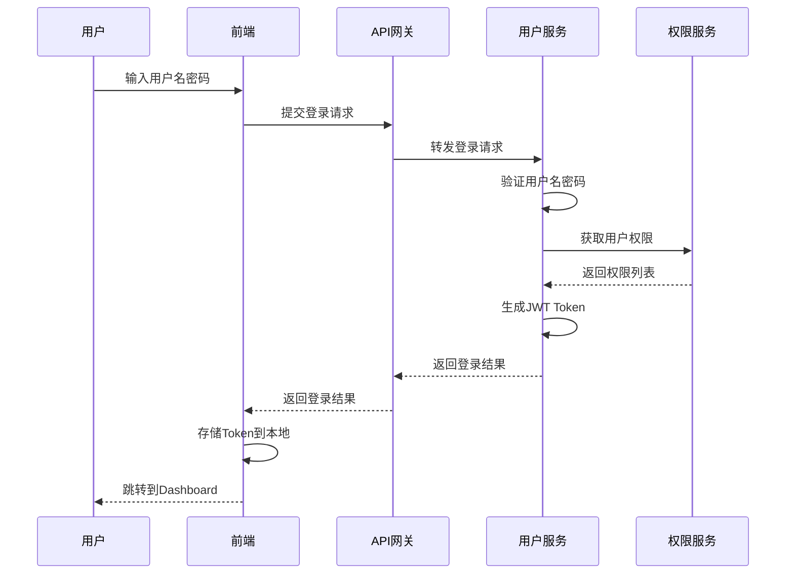
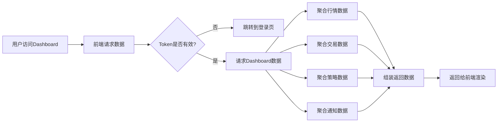

# 用户交互子系统详细设计

## 1. 子系统概述
用户交互子系统是系统与终端用户交互的入口，负责用户界面展示、用户管理、权限控制、数据可视化、个性化配置和消息通知等功能，为不同角色的用户提供友好、高效的操作界面。

### 1.1 核心职责
- 用户账号管理和身份认证
- 角色权限管理和访问控制
- 系统dashboard和数据可视化
- 行情、策略、交易等业务功能界面
- 实时消息推送和通知中心
- 用户个性化配置和偏好设置
- 操作日志和行为审计

### 1.2 模块划分
```
user-interface/
├── backend               # 后端服务
│   ├── user-management   # 用户管理模块
│   ├── permission-management # 权限管理模块
│   ├── dashboard-service # Dashboard数据服务
│   ├── notification-service # 通知服务
│   └── configuration-service # 个性化配置服务
├── frontend              # 前端应用
│   ├── layout            # 布局组件
│   ├── pages             # 页面组件
│   ├── components        # 公共组件
│   ├── charts            # 图表组件
│   └── utils             # 前端工具库
└── gateway               # API网关层
    ├── authentication    # 认证中间件
    ├── authorization     # 授权中间件
    ├── rate-limiter      # 限流中间件
    └── request-logger    # 请求日志中间件
```

## 2. 核心类设计
### 2.1 用户管理模块
#### 2.1.1 UserService (用户服务)
```python
from typing import Dict, List, Optional
from datetime import datetime, timedelta
import jwt
import bcrypt
from .model import User, Role
from common.utils import CryptoUtils, DateTimeUtils

class UserService:
    """用户管理服务"""

    def __init__(self, config: Dict):
        self.jwt_secret = config['jwt_secret']
        self.jwt_expire_minutes = config.get('jwt_expire_minutes', 120)
        self.refresh_token_expire_days = config.get('refresh_token_expire_days', 7)

    def register(self, username: str, email: str, password: str, role_id: int = None) -> User:
        """用户注册"""
        # 检查用户名和邮箱是否已存在
        if self._is_username_exists(username):
            raise ValueError("用户名已存在")
        if self._is_email_exists(email):
            raise ValueError("邮箱已存在")

        # 生成密码哈希
        salt = bcrypt.gensalt()
        password_hash = bcrypt.hashpw(password.encode(), salt).decode()

        # 创建用户
        user = User(
            username=username,
            email=email,
            password_hash=password_hash,
            role_id=role_id or self._get_default_role_id(),
            status=1,
            created_at=DateTimeUtils.now()
        )
        self._save_user(user)
        return user

    def login(self, username: str, password: str) -> Dict:
        """用户登录"""
        user = self._get_user_by_username(username)
        if not user or user.status != 1:
            raise ValueError("用户名或密码错误")

        # 验证密码
        if not bcrypt.checkpw(password.encode(), user.password_hash.encode()):
            raise ValueError("用户名或密码错误")

        # 生成JWT Token
        access_token = self._generate_access_token(user)
        refresh_token = self._generate_refresh_token(user)

        # 更新登录时间
        user.last_login_at = DateTimeUtils.now()
        self._save_user(user)

        return {
            "access_token": access_token,
            "refresh_token": refresh_token,
            "expires_in": self.jwt_expire_minutes * 60,
            "user_info": self._get_user_info(user)
        }

    def refresh_token(self, refresh_token: str) -> Dict:
        """刷新访问令牌"""
        try:
            payload = jwt.decode(refresh_token, self.jwt_secret, algorithms=['HS256'])
            user = self._get_user_by_id(payload['user_id'])
            if not user or user.status != 1:
                raise ValueError("无效的刷新令牌")

            access_token = self._generate_access_token(user)
            return {
                "access_token": access_token,
                "expires_in": self.jwt_expire_minutes * 60
            }
        except jwt.InvalidTokenError:
            raise ValueError("无效的刷新令牌")

    def _generate_access_token(self, user: User) -> str:
        """生成访问令牌"""
        payload = {
            "user_id": user.user_id,
            "username": user.username,
            "role_id": user.role_id,
            "exp": DateTimeUtils.now() + timedelta(minutes=self.jwt_expire_minutes),
            "type": "access"
        }
        return jwt.encode(payload, self.jwt_secret, algorithm='HS256')

    def _generate_refresh_token(self, user: User) -> str:
        """生成刷新令牌"""
        payload = {
            "user_id": user.user_id,
            "exp": DateTimeUtils.now() + timedelta(days=self.refresh_token_expire_days),
            "type": "refresh"
        }
        return jwt.encode(payload, self.jwt_secret, algorithm='HS256')
```

#### 2.1.2 PermissionManager (权限管理器)
```python
from typing import List, Dict
from .model import Role, Permission, User

class PermissionManager:
    """权限管理器，基于RBAC模型"""

    def __init__(self):
        self.permission_cache = {}  # 角色权限缓存

    def has_permission(self, user_id: int, permission_code: str) -> bool:
        """检查用户是否拥有指定权限"""
        user = self._get_user(user_id)
        if not user or user.status != 1:
            return False

        # 超级管理员拥有所有权限
        if user.role.is_super_admin:
            return True

        # 获取角色权限
        permissions = self._get_role_permissions(user.role_id)
        return permission_code in permissions

    def get_user_permissions(self, user_id: int) -> List[str]:
        """获取用户的所有权限"""
        user = self._get_user(user_id)
        if not user or user.status != 1:
            return []

        if user.role.is_super_admin:
            return self._get_all_permission_codes()

        return self._get_role_permissions(user.role_id)

    def add_role_permission(self, role_id: int, permission_id: int):
        """为角色添加权限"""
        self._add_permission(role_id, permission_id)
        # 清除缓存
        if role_id in self.permission_cache:
            del self.permission_cache[role_id]

    def remove_role_permission(self, role_id: int, permission_id: int):
        """移除角色权限"""
        self._remove_permission(role_id, permission_id)
        # 清除缓存
        if role_id in self.permission_cache:
            del self.permission_cache[role_id]

    def _get_role_permissions(self, role_id: int) -> List[str]:
        """获取角色的权限列表，带缓存"""
        if role_id in self.permission_cache:
            return self.permission_cache[role_id]

        permissions = self._query_role_permissions(role_id)
        permission_codes = [p.permission_code for p in permissions]
        self.permission_cache[role_id] = permission_codes
        return permission_codes
```

### 2.2 Dashboard服务
#### 2.2.1 DashboardDataService (Dashboard数据服务)
```python
from typing import Dict, List
from datetime import datetime, timedelta
import pandas as pd
from .data_fetcher import MarketDataFetcher, TradeDataFetcher, StrategyDataFetcher

class DashboardDataService:
    """Dashboard数据聚合服务"""

    def __init__(self):
        self.market_fetcher = MarketDataFetcher()
        self.trade_fetcher = TradeDataFetcher()
        self.strategy_fetcher = StrategyDataFetcher()

    def get_user_dashboard(self, user_id: int) -> Dict:
        """获取用户Dashboard数据"""
        return {
            "overview": self._get_overview_data(user_id),
            "market_trend": self._get_market_trend(),
            "portfolio_performance": self._get_portfolio_performance(user_id),
            "strategy_performance": self._get_strategy_performance(user_id),
            "recent_trades": self._get_recent_trades(user_id),
            "notifications": self._get_recent_notifications(user_id)
        }

    def _get_overview_data(self, user_id: int) -> Dict:
        """获取概览数据"""
        account = self.trade_fetcher.get_user_account(user_id)
        return {
            "total_asset": account.total_asset,
            "day_profit": account.day_profit,
            "day_profit_ratio": account.day_profit_ratio,
            "total_profit": account.total_profit,
            "total_profit_ratio": account.total_profit_ratio,
            "position_ratio": account.position_ratio,
            "strategy_count": self.strategy_fetcher.get_user_strategy_count(user_id),
            "running_strategy_count": self.strategy_fetcher.get_running_strategy_count(user_id)
        }

    def _get_portfolio_performance(self, user_id: int) -> Dict:
        """获取投资组合业绩"""
        end_date = datetime.now()
        start_date = end_date - timedelta(days=30)
        net_value_curve = self.trade_fetcher.get_net_value_curve(user_id, start_date, end_date)
        benchmark_curve = self.market_fetcher.get_index_curve("000300.SH", start_date, end_date)

        return {
            "net_value_curve": net_value_curve,
            "benchmark_curve": benchmark_curve,
            "performance": {
                "total_return": self._calculate_total_return(net_value_curve),
                "sharpe_ratio": self._calculate_sharpe_ratio(net_value_curve),
                "max_drawdown": self._calculate_max_drawdown(net_value_curve),
                "win_rate": self._calculate_win_rate(user_id)
            }
        }
```

### 2.3 通知服务
#### 2.3.1 NotificationService (通知服务)
```python
from typing import List, Dict
from datetime import datetime
import asyncio
from websockets import serve
import json
from .model import Notification
from common.utils import DateTimeUtils

class NotificationService:
    """通知服务，支持多渠道推送"""

    def __init__(self):
        self.connected_clients = {}  # user_id -> websocket连接
        self.channels = {
            "system": self._send_system_notification,
            "trade": self._send_trade_notification,
            "market": self._send_market_notification,
            "strategy": self._send_strategy_notification
        }

    async def start_websocket_server(self, host: str = "0.0.0.0", port: int = 8765):
        """启动WebSocket服务"""
        async with serve(self._handle_connection, host, port):
            await asyncio.Future()  # 永久运行

    async def _handle_connection(self, websocket):
        """处理WebSocket连接"""
        try:
            # 认证
            auth_message = await websocket.recv()
            auth_data = json.loads(auth_message)
            token = auth_data.get('token')
            user_id = self._validate_token(token)
            if not user_id:
                await websocket.close(code=1008, reason="认证失败")
                return

            # 保存连接
            self.connected_clients[user_id] = websocket

            # 发送未读消息
            unread_notifications = self._get_unread_notifications(user_id)
            for notification in unread_notifications:
                await websocket.send(json.dumps(notification.to_dict()))

            # 保持连接
            while True:
                try:
                    ping = await websocket.recv()
                    await websocket.send(ping)
                except:
                    break

        finally:
            # 移除连接
            if user_id in self.connected_clients:
                del self.connected_clients[user_id]

    def send_notification(self, user_id: int, channel: str, title: str, content: str, level: str = "info"):
        """发送通知"""
        # 保存到数据库
        notification = Notification(
            user_id=user_id,
            channel=channel,
            title=title,
            content=content,
            level=level,
            read=False,
            created_at=DateTimeUtils.now()
        )
        self._save_notification(notification)

        # 在线用户实时推送
        if user_id in self.connected_clients:
            asyncio.create_task(self._push_to_client(user_id, notification.to_dict()))

        # 根据渠道选择其他推送方式
        if channel in self.channels:
            self.channels[channel](user_id, title, content)
```

## 3. 接口详细设计
### 3.1 REST API接口
#### 3.1.1 用户登录接口
- **路径**：`POST /api/v1/auth/login`
- **功能**：用户登录获取Token
- **请求参数**：
  ```json
  {
    "username": "test_user",
    "password": "password123"
  }
  ```
- **返回结果**：
  ```json
  {
    "code": 200,
    "message": "success",
    "data": {
      "access_token": "eyJhbGciOiJIUzI1NiIsInR5cCI6IkpXVCJ9...",
      "refresh_token": "eyJhbGciOiJIUzI1NiIsInR5cCI6IkpXVCJ9...",
      "expires_in": 7200,
      "user_info": {
        "user_id": 1001,
        "username": "test_user",
        "email": "test@example.com",
        "role": "quant_researcher",
        "permissions": ["strategy:view", "strategy:edit", "trade:order"]
      }
    },
    "request_id": "xxx",
    "timestamp": 1711605600
  }
  ```

#### 3.1.2 获取Dashboard数据接口
- **路径**：`GET /api/v1/dashboard`
- **功能**：获取用户Dashboard数据
- **返回结果**：
  ```json
  {
    "code": 200,
    "message": "success",
    "data": {
      "overview": {
        "total_asset": 125600.00,
        "day_profit": 220.00,
        "day_profit_ratio": 0.0018,
        "total_profit": 25600.00,
        "total_profit_ratio": 0.256,
        "position_ratio": 0.35,
        "strategy_count": 5,
        "running_strategy_count": 2
      },
      "portfolio_performance": {
        "net_value_curve": [
          {"date": "2026-03-01", "value": 100000},
          {"date": "2026-03-28", "value": 125600}
        ],
        "benchmark_curve": [
          {"date": "2026-03-01", "value": 1000},
          {"date": "2026-03-28", "value": 1035}
        ],
        "performance": {
          "total_return": 0.256,
          "sharpe_ratio": 1.85,
          "max_drawdown": 0.087,
          "win_rate": 0.62
        }
      },
      "recent_trades": [
        {
          "trade_time": "2026-03-28 10:30:00",
          "stock_code": "600000.SH",
          "side": "买",
          "price": 12.34,
          "quantity": 1000,
          "profit": 0
        }
      ]
    },
    "request_id": "xxx",
    "timestamp": 1711605600
  }
  ```

#### 3.1.3 通知列表接口
- **路径**：`GET /api/v1/notifications`
- **功能**：获取通知列表
- **请求参数**：
  | 参数名 | 类型 | 是否必填 | 说明 |
  |--------|------|----------|------|
  | read | Boolean | 否 | 是否已读过滤 |
  | channel | String | 否 | 通知渠道过滤 |
  | page | Integer | 否 | 页码，默认1 |
  | page_size | Integer | 否 | 每页大小，默认20 |

### 3.2 WebSocket接口
#### 3.2.1 连接认证
```json
// 客户端发送
{
  "type": "auth",
  "token": "eyJhbGciOiJIUzI1NiIsInR5cCI6IkpXVCJ9..."
}

// 服务端响应
{
  "type": "auth_success",
  "message": "连接成功"
}
```

#### 3.2.2 实时通知推送
```json
// 服务端推送
{
  "type": "notification",
  "data": {
    "id": 1,
    "channel": "trade",
    "title": "订单成交通知",
    "content": "您的订单ORD000000000001已全部成交，成交价12.34元，数量1000股",
    "level": "info",
    "created_at": "2026-03-28 10:30:00"
  }
}
```

## 4. 业务流程设计
### 4.1 用户登录流程


### 4.2 Dashboard加载流程


## 5. 数据库表结构详细设计
### 5.1 PostgreSQL表结构
#### 5.1.1 用户表
```sql
CREATE TABLE users (
    user_id BIGSERIAL PRIMARY KEY,
    username VARCHAR(50) UNIQUE NOT NULL,
    email VARCHAR(100) UNIQUE NOT NULL,
    password_hash VARCHAR(255) NOT NULL,
    role_id INTEGER NOT NULL,
    real_name VARCHAR(50),
    phone VARCHAR(20),
    avatar_url VARCHAR(255),
    status SMALLINT DEFAULT 1, -- 0:禁用 1:正常 2:锁定
    last_login_at TIMESTAMP,
    last_login_ip VARCHAR(50),
    created_at TIMESTAMP DEFAULT CURRENT_TIMESTAMP,
    updated_at TIMESTAMP DEFAULT CURRENT_TIMESTAMP,
    FOREIGN KEY (role_id) REFERENCES roles(role_id)
);

CREATE INDEX idx_user_username ON users(username);
CREATE INDEX idx_user_email ON users(email);
```

#### 5.1.2 角色表
```sql
CREATE TABLE roles (
    role_id SERIAL PRIMARY KEY,
    role_name VARCHAR(50) UNIQUE NOT NULL,
    role_code VARCHAR(50) UNIQUE NOT NULL,
    description TEXT,
    is_super_admin BOOLEAN DEFAULT false,
    enabled BOOLEAN DEFAULT true,
    created_at TIMESTAMP DEFAULT CURRENT_TIMESTAMP
);

-- 初始角色数据
INSERT INTO roles (role_name, role_code, description, is_super_admin) VALUES
('超级管理员', 'super_admin', '系统最高权限', true),
('量化研究员', 'quant_researcher', '策略研究和回测', false),
('交易员', 'trader', '实盘交易和账户管理', false),
('风控经理', 'risk_manager', '风险监控和合规管理', false),
('普通用户', 'viewer', '只读权限', false);
```

#### 5.1.3 权限表
```sql
CREATE TABLE permissions (
    permission_id SERIAL PRIMARY KEY,
    permission_name VARCHAR(100) NOT NULL,
    permission_code VARCHAR(100) UNIQUE NOT NULL,
    permission_group VARCHAR(50) NOT NULL, -- 所属权限组
    description TEXT,
    created_at TIMESTAMP DEFAULT CURRENT_TIMESTAMP
);

-- 角色权限关联表
CREATE TABLE role_permissions (
    role_id INTEGER NOT NULL,
    permission_id INTEGER NOT NULL,
    created_at TIMESTAMP DEFAULT CURRENT_TIMESTAMP,
    PRIMARY KEY (role_id, permission_id),
    FOREIGN KEY (role_id) REFERENCES roles(role_id),
    FOREIGN KEY (permission_id) REFERENCES permissions(permission_id)
);
```

#### 5.1.4 通知表
```sql
CREATE TABLE notifications (
    notification_id BIGSERIAL PRIMARY KEY,
    user_id BIGINT NOT NULL,
    channel VARCHAR(50) NOT NULL, -- system/trade/market/strategy
    title VARCHAR(255) NOT NULL,
    content TEXT NOT NULL,
    level VARCHAR(20) NOT NULL, -- info/warning/error/success
    read BOOLEAN DEFAULT false,
    read_at TIMESTAMP,
    created_at TIMESTAMP NOT NULL,
    FOREIGN KEY (user_id) REFERENCES users(user_id)
);

CREATE INDEX idx_notification_user ON notifications(user_id);
CREATE INDEX idx_notification_read ON notifications(read);
```

#### 5.1.5 用户配置表
```sql
CREATE TABLE user_configurations (
    config_id BIGSERIAL PRIMARY KEY,
    user_id BIGINT NOT NULL,
    config_key VARCHAR(100) NOT NULL,
    config_value TEXT NOT NULL,
    config_type VARCHAR(20) DEFAULT 'string', -- string/number/boolean/json
    created_at TIMESTAMP DEFAULT CURRENT_TIMESTAMP,
    updated_at TIMESTAMP DEFAULT CURRENT_TIMESTAMP,
    UNIQUE(user_id, config_key),
    FOREIGN KEY (user_id) REFERENCES users(user_id)
);
```

## 6. 异常处理设计
### 6.1 异常类型
| 异常类型 | 说明 | 处理策略 |
|----------|------|----------|
| AuthenticationError | 认证失败 | 返回401错误，引导用户重新登录 |
| PermissionDeniedError | 权限不足 | 返回403错误，提示用户无权限 |
| InvalidTokenError | Token无效 | 返回401错误，需要重新获取Token |
| UserLockedError | 用户被锁定 | 返回403错误，提示联系管理员解锁 |

### 6.2 前端异常处理
- **网络异常**：自动重试3次，失败显示友好提示
- **接口错误**：根据错误码显示对应的提示信息
- **数据格式错误**：降级显示默认值，记录错误日志
- **页面加载失败**：显示加载失败页面，提供重试按钮

## 7. 单元测试用例要点
### 7.1 用户管理模块
- 测试用户注册、登录、登出功能正确性
- 测试密码加密和验证逻辑
- 测试Token生成和刷新功能
- 测试用户状态管理（禁用、锁定）

### 7.2 权限管理模块
- 测试RBAC权限模型正确性
- 测试权限缓存机制
- 测试超级管理员权限逻辑
- 测试权限动态更新功能

### 7.3 Dashboard模块
- 测试Dashboard数据聚合正确性
- 测试性能指标计算正确性
- 测试并发访问性能
- 测试空数据和异常数据处理

### 7.4 通知模块
- 测试WebSocket连接和认证
- 测试实时消息推送功能
- 测试多渠道通知功能
- 测试消息存储和已读状态管理

## 8. 性能指标
| 指标 | 要求 |
|------|------|
| 页面首屏加载时间 | <2秒 |
| Dashboard接口响应时间 | <500毫秒 |
| WebSocket消息推送延迟 | <1秒 |
| 登录接口响应时间 | <100毫秒 |
| 单节点支持同时在线用户 | >1000人 |
| 静态资源加载速度 | <500毫秒 |
| 系统可用性 | 99.99% |
