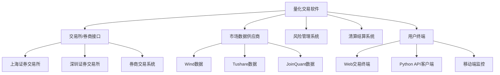

# 2. 总体描述

## 2.1 产品视角

### 2.1.1 系统上下文

本系统作为A股量化交易的核心平台，与以下外部系统交互：

### 2.1.2 系统接口

#### 数据接口
- **市场数据接口**：接收Level 1/Level 2实时行情数据
- **基本面数据接口**：获取公司财务报表、公告信息
- **参考数据接口**：股票代码表、交易日历、成分股信息

#### 交易接口
- **券商交易接口**：通过各券商API执行订单
- **CTP期货接口**：期货交易接口（未来扩展）
- **FIX协议接口**：标准化交易接口（机构版）

#### 管理接口
- **风险系统接口**：实时风险指标推送
- **清算系统接口**：日终对账文件交换
- **监控系统接口**：系统状态和报警推送

## 2.2 产品功能

### 2.2.1 核心功能模块

#### 1. 数据管理系统（优先级：高）
- 实时市场数据采集与分发
- 历史数据存储与检索
- 基本面数据整合
- 数据质量监控与清洗
- 数据访问权限控制

#### 2. 策略研究系统
- 策略开发环境（Python/Jupyter）
- 回测引擎（历史回测、事件驱动）
- 策略优化与参数调优
- 模拟交易（Paper Trading）
- 策略绩效分析

#### 3. 交易执行系统
- 订单管理（创建、修改、取消）
- 智能订单路由
- 算法交易（VWAP、TWAP、POV）
- 执行监控与报警
- 交易成本分析

#### 4. 风险管理系统
- 实时风险监控（市值、VAR、敞口）
- 交易限额管理
- 合规规则引擎
- 压力测试与情景分析
- 风险报告生成

#### 5. 用户界面系统
- Web交易终端
- Python API客户端
- 管理控制台
- 实时监控仪表盘
- 报告查看器

### 2.2.2 功能优先级

| 优先级 | 功能模块 | 发布版本 |
|--------|----------|----------|
| P0 | 数据管理系统核心功能 | V1.0 |
| P0 | 基础交易执行功能 | V1.0 |
| P1 | 策略回测框架 | V1.0 |
| P1 | 基础风险管理 | V1.0 |
| P2 | 算法交易 | V1.1 |
| P2 | 高级风险管理 | V1.1 |
| P3 | 多市场支持 | V1.2 |
| P3 | 移动端应用 | V1.2 |

## 2.3 用户特征

### 2.3.1 用户类别

#### 量化研究员（主要用户）
- **背景**：金融工程、计算机科学、数学等相关专业
- **技术能力**：精通Python，熟悉pandas/numpy等数据分析库
- **使用频率**：每日使用，长时间交互
- **关键需求**：灵活的策略开发环境、高效的回测引擎、丰富的数据API

#### 交易员
- **背景**：金融交易相关经验
- **技术能力**：中等技术能力，熟悉交易操作
- **使用频率**：交易时间实时使用
- **关键需求**：直观的交易界面、快速订单执行、实时风险监控

#### 风险经理
- **背景**：风险管理、金融工程
- **技术能力**：熟悉风险模型和监管要求
- **使用频率**：每日监控，定期报告
- **关键需求**：全面的风险指标、实时报警、定制化报告

#### 合规官
- **背景**：法律、合规专业
- **技术能力**：基本计算机操作能力
- **使用频率**：定期检查，事件调查
- **关键需求**：完整的审计追踪、合规规则引擎、监管报告

#### 系统管理员
- **背景**：IT运维、系统管理
- **技术能力**：高级技术能力，熟悉Linux和网络
- **使用频率**：日常运维，故障处理
- **关键需求**：系统监控、配置管理、备份恢复

### 2.3.2 用户统计

| 用户角色 | 预估数量 | 并发用户数 | 使用时段 |
|----------|----------|------------|----------|
| 量化研究员 | 20-50人 | 10-30人 | 全天，高峰在盘后分析时段 |
| 交易员 | 5-20人 | 5-15人 | 交易时间（9:30-15:00） |
| 风险经理 | 2-5人 | 2-5人 | 交易时间及盘后 |
| 合规官 | 1-3人 | 1-2人 | 工作时间 |
| 系统管理员 | 2-4人 | 1-2人 | 全天候支持 |

## 2.4 约束

### 2.4.1 技术约束
1. **编程语言**：核心系统使用Python 3.8+，性能关键组件可使用C++/Rust
2. **数据库**：支持PostgreSQL 12+（关系型）和InfluxDB/ClickHouse（时序数据）
3. **消息队列**：使用RabbitMQ或Kafka进行异步通信
4. **前端框架**：Web界面使用React/Vue.js，图表使用ECharts/Plotly
5. **部署环境**：支持Linux服务器部署（CentOS 7+/Ubuntu 18.04+）

### 2.4.2 监管约束
1. **交易规则**：严格遵守A股T+1交易制度、涨跌停限制
2. **数据安全**：符合《网络安全法》和证监会数据安全要求
3. **审计要求**：所有交易操作必须留存6年以上审计日志
4. **客户识别**：符合反洗钱（AML）客户身份识别要求

### 2.4.3 业务约束
1. **市场时间**：系统需适应A股交易时间（9:30-11:30, 13:00-15:00）
2. **数据延迟**：实时行情延迟不得超过3秒
3. **订单响应**：订单提交到券商API响应时间不得超过2秒
4. **系统可用性**：交易时间系统可用性需达到99.9%

## 2.5 假设与依赖

### 2.5.1 假设
1. 用户具备基本的金融知识和计算机操作能力
2. 公司已获得相应的证券交易资质和接口权限
3. 有稳定的网络连接和机房环境
4. 第三方数据供应商服务稳定可靠
5. 券商交易接口稳定且符合行业标准

### 2.5.2 外部依赖
1. **交易所接口**：依赖上交所、深交所提供的行情和交易接口
2. **数据供应商**：依赖Wind、Tushare、JoinQuant等数据服务
3. **券商系统**：依赖合作券商的交易接口稳定性
4. **监管政策**：依赖中国证监会的政策稳定性

### 2.5.3 内部依赖
1. **基础设施**：依赖公司内部网络、服务器和存储资源
2. **人力资源**：依赖具备量化交易系统开发经验的团队
3. **合规审批**：依赖内部合规部门的审批流程

## 2.6 部署与运行环境

### 2.6.1 硬件环境
| 组件 | 最低配置 | 推荐配置 | 说明 |
|------|----------|----------|------|
| 应用服务器 | 8核CPU, 32GB RAM | 16核CPU, 64GB RAM | 运行核心交易逻辑 |
| 数据库服务器 | 8核CPU, 64GB RAM | 16核CPU, 128GB RAM | PostgreSQL/时序数据库 |
| 行情服务器 | 4核CPU, 16GB RAM | 8核CPU, 32GB RAM | 实时行情接收与分发 |
| 网络带宽 | 100Mbps专线 | 1Gbps专线 | 与交易所/券商连接 |

### 2.6.2 软件环境
- **操作系统**：Linux（CentOS 7.6+或Ubuntu 18.04+）
- **Python环境**：Python 3.8+，虚拟环境管理
- **数据库**：PostgreSQL 12+，Redis 6.0+，InfluxDB 2.0+
- **消息队列**：RabbitMQ 3.8+或Apache Kafka 2.8+
- **容器化**：Docker 20.10+，Kubernetes 1.20+（可选）

### 2.6.3 网络环境
- **交易网络**：专线连接交易所/券商，低延迟要求
- **数据网络**：专线连接数据供应商，高带宽要求
- **办公网络**：VPN接入，安全访问控制
- **互联网接入**：用户远程访问，SSL加密传输
