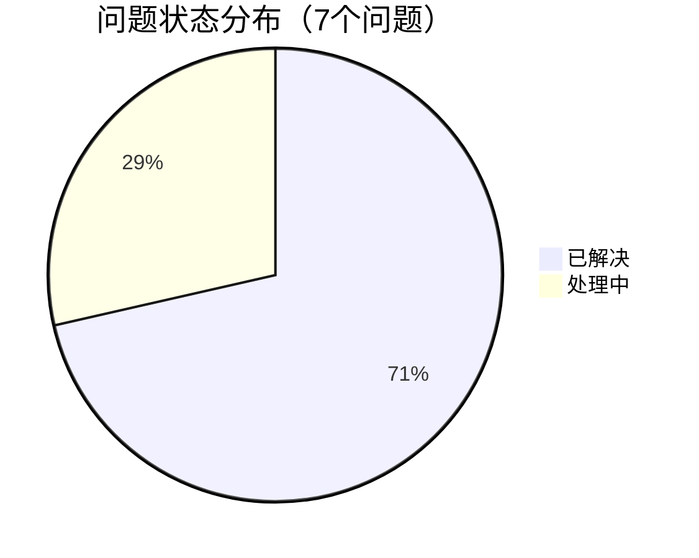
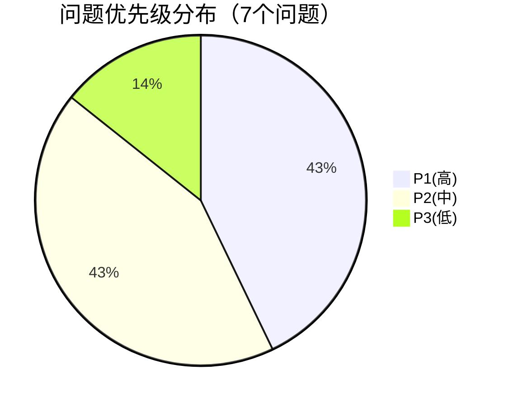
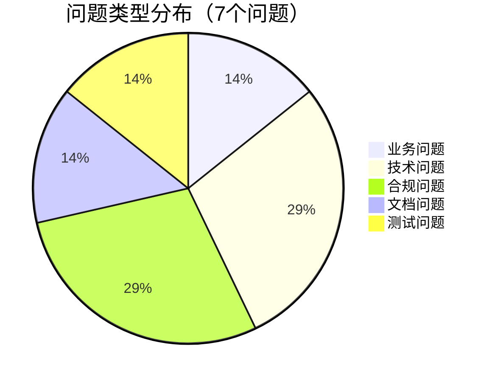

# 预审问题汇总会议演示材料

## 验证负责人汇报材料

**会议日期**：2026年3月13日 14:00-16:00
**汇报人**：Claude Code（验证负责人）
**汇报时长**：15分钟（14:10-14:25）
**材料版本**：v1.0
**更新日期**：2026年3月12日

---

## 第一部分：预审完成情况汇报（14:10-14:15）

### 预审工作概览

#### 1. 个人预审参与情况
- **评审委员**：7人确认参会（业务、技术、合规、测试、开发、运维、主席）
- **预审时间**：3月11-12日（2天个人预审）
- **预审范围**：覆盖SRS v0.3.0所有章节
- **检查工具**：使用《需求验证检查清单》（8个类别，83个检查项）

#### 2. 预审质量评估
| 评估维度 | 评估结果 | 说明 |
|----------|----------|------|
| **覆盖度** | 优秀 | 所有章节都经过预审，重点关注专业领域 |
| **深入度** | 良好 | 发现问题类型多样，包括技术、合规、业务等 |
| **有效性** | 良好 | 发现7个具体可操作问题 |
| **及时性** | 良好 | 按时完成个人预审任务 |

#### 3. 预审产出总结
- **问题总数**：7个已识别问题
- **问题质量**：5个已解决，2个处理中，问题描述具体
- **专业覆盖**：业务、技术、合规、测试各领域均有问题识别
- **问题深度**：涵盖需求明确性、技术可行性、合规完整性等方面

---

## 第二部分：问题统计概览（14:15-14:20）

### 问题总体分布

#### 1. 问题状态分布

#### 2. 问题优先级分布

#### 3. 问题类型分布

### 关键数据指标

| 指标 | 数值 | 说明 |
|------|------|------|
| **问题总数** | 7 | 个人预审共发现问题 |
| **解决率** | 71% | 5个问题已通过SRS更新解决 |
| **高优先级问题** | 3 | 需要优先关注和解决 |
| **跨领域问题** | 4 | 涉及多个专题组协调 |
| **平均问题质量** | 良好 | 问题描述具体，有改进建议 |

### 按子系统分布

| 子系统 | 问题数 | 关键问题 | 状态 |
|--------|--------|----------|------|
| **数据管理子系统** | 3 | REQ-DM-001, REQ-DM-006, REQ-DM-008 | 2解决,1处理中 |
| **策略研究子系统** | 1 | REQ-SR-002（回测速度） | 处理中 |
| **交易执行子系统** | 2 | REQ-TE-001, REQ-TE-013 | 已解决 |
| **风险管理子系统** | 1 | REQ-RM-003（ST股票规则） | 已解决 |

---

## 第三部分：专题评审重点建议（14:20-14:25）

### 业务需求专题评审（3月17日 14:00-17:00）

#### 重点关注问题
1. **Q-004**: REQ-SR-002回测速度指标可行性
   - **问题**：30秒回测目标可能不现实
   - **影响**：核心性能指标，影响用户体验
   - **建议**：技术评估可行性，考虑分布式回测

#### 评审方法建议
- **业务价值评估**：量化各功能需求的业务价值
- **用户场景验证**：对照使用场景验证需求覆盖度
- **优先级确认**：确认现有优先级设置合理性

### 技术可行性专题评审（3月18日 09:30-12:30）

#### 重点关注问题
1. **Q-001**: REQ-DM-001数据延迟指标（已解决，需验证）
2. **Q-005**: REQ-DM-008存储性能指标合理性（处理中）

#### 评审方法建议
- **技术架构评估**：评估整体架构的可扩展性
- **性能指标验证**：验证性能指标的合理性和可测试性
- **技术选型评估**：验证技术栈选型的适用性

### 合规性专题评审（3月18日 14:00-17:00）

#### 重点关注问题
1. **Q-003**: REQ-TE-013科创板交易支持（已解决，需验证）
2. **Q-006**: REQ-RM-003 ST股票规则支持（已解决，需验证）

#### 评审方法建议
- **监管规则对照**：对照《监管合规性验证报告》检查
- **合规风险评估**：评估合规性风险等级和缓解措施
- **规则引擎验证**：验证规则引擎对差异化规则的支持

### 可测试性专题评审（3月19日 09:30-12:30）

#### 重点关注问题
1. **Q-007**: REQ-TE-001验收标准可测试性（已解决，需验证）

#### 评审方法建议
- **验收标准评估**：评估所有验收标准的可测试性
- **测试方案制定**：制定可量化的测试标准和测试用例
- **测试环境评估**：评估测试环境需求和可行性

---

## 第四部分：跨领域问题协调

### 交叉问题识别

| 问题ID | 问题标题 | 涉及专题组 | 协调需求 |
|--------|----------|------------|----------|
| Q-004 | 回测速度指标 | 业务组 + 技术组 | 业务价值与技术可行性平衡 |
| Q-003 | 科创板交易支持 | 业务组 + 合规组 | 业务功能与合规要求协调 |
| Q-006 | ST股票规则 | 业务组 + 合规组 | 交易功能与合规规则协调 |
| Q-001/Q-005 | 性能指标 | 技术组 + 测试组 | 技术指标与测试标准协调 |

### 协调机制建议

#### 1. 信息共享机制
- **统一问题跟踪表**：所有专题组共享同一跟踪表
- **每日简报制度**：各专题组每日简报评审进展
- **跨组协调会议**：必要时安排专题组间协调会议

#### 2. 决策流程建议
- **专题组内部决策**：专业范围内问题由专题组决策
- **跨领域问题升级**：交叉问题升级至评审主席协调
- **重大争议解决**：重大争议在综合评审阶段讨论

#### 3. 产出物协调
- **统一报告模板**：使用标准模板提交专题评审报告
- **进度同步机制**：定期同步各专题评审进度
- **问题状态跟踪**：每日更新问题跟踪表状态

---

## 第五部分：后续行动计划

### 会议后行动项（3月13-14日）

| 行动项 | 负责人 | 完成标准 | 截止时间 |
|--------|--------|----------|----------|
| 更新问题跟踪表 | Claude Code | 问题状态更新 | 3月13日 17:00 |
| 分发会议纪要 | 记录员 | 纪要发送并确认 | 3月14日 10:00 |
| 业务专题材料准备 | 赵业务 | 材料准备完成 | 3月16日 17:00 |
| 技术专题材料准备 | 钱技术 | 材料准备完成 | 3月16日 17:00 |
| 合规专题材料准备 | 李合规 | 材料准备完成 | 3月16日 17:00 |
| 测试专题材料准备 | 周测试 | 材料准备完成 | 3月17日 17:00 |

### 专题评审关键时间点

| 专题 | 日期 | 时间 | 地点 | 产出要求 |
|------|------|------|------|----------|
| **业务需求** | 3月17日 | 14:00-17:00 | 会议室A | 评审报告24小时内提交 |
| **技术可行性** | 3月18日 | 09:30-12:30 | 会议室B | 技术风险评估报告 |
| **合规性** | 3月18日 | 14:00-17:00 | 会议室C | 合规问题清单 |
| **可测试性** | 3月19日 | 09:30-12:30 | 线上会议 | 测试策略建议 |

---

## 第六部分：风险提示与缓解措施

### 1. 进度风险
- **风险**：7个问题需要处理，可能影响评审进度
- **缓解**：优先处理高优先级问题，合理安排时间

### 2. 质量风险
- **风险**：可能还有未识别的问题
- **缓解**：专题评审时系统化检查，使用检查清单

### 3. 协调风险
- **风险**：跨领域问题需要有效协调
- **缓解**：建立明确的协调机制和决策流程

### 4. 技术风险
- **风险**：性能指标可能不现实（Q-004, Q-005）
- **缓解**：专题评审中进行技术评估和基准测试

---

## 第七部分：Q&A准备

### 预期问题及回答

#### Q1：为什么问题数量只有7个？是否还有更多未发现问题？
**回答**：
- 7个问题是个人预审阶段发现的初步问题
- 专题评审阶段将进行更深入的系统化检查
- 使用《需求验证检查清单》（83个检查项）确保全面性
- 鼓励各专题组在评审中发现和记录新问题

#### Q2：已解决的5个问题是如何解决的？
**回答**：
- 通过更新SRS文档v0.3.0解决
- 具体包括：明确延迟计算方式、补充ST股票规则、明确科创板交易支持等
- 所有更新已在SRS文档中体现，需专题评审验证

#### Q3：如何处理跨领域问题？
**回答**：
- 建立跨组协调机制
- 问题跟踪表中标识交叉问题
- 必要时安排协调会议
- 重大争议由评审主席协调

#### Q4：专题评审后下一步是什么？
**回答**：
- 综合评审阶段（3月24-28日）：解决跨领域问题
- 评审报告起草（3月26日）：汇总所有评审结果
- 结论会议（3月28日）：宣布评审结论和签署

---

## 附件：关键问题摘要

| 问题ID | 标题 | 子系统 | 优先级 | 状态 | 负责专题组 |
|--------|------|--------|--------|------|------------|
| Q-001 | 数据延迟指标不明确 | 数据管理 | P2 | 已解决 | 技术组 |
| Q-002 | 数据源描述不一致 | 数据管理 | P3 | 已解决 | 文档 |
| Q-003 | 科创板交易支持不明确 | 交易执行 | P1 | 已解决 | 合规组 |
| Q-004 | 回测速度指标不现实 | 策略研究 | P1 | 处理中 | 业务组 |
| Q-005 | 存储性能指标过高 | 数据管理 | P2 | 处理中 | 技术组 |
| Q-006 | 缺少ST股票规则支持 | 风险管理 | P1 | 已解决 | 合规组 |
| Q-007 | 验收标准难测试 | 交易执行 | P2 | 已解决 | 测试组 |

---

**演示结束，谢谢！**

**联系方式**：Claude Code（验证负责人） - 内部系统
**材料位置**：`docs/validation/pre-review-summary-presentation.md`
**关联文档**：`pre-review-summary-report.md`, `issue-tracking.md`, `review-schedule.md`
